# The Collection
The Collection is a site, which allows a registered user to create and easily manage collections of his beloved items.

The application satisfies the demand for a simple solution to easily inventory individual things in a beautifully designed catalog. This can be, for example, a collection of weapons, a collection of model cars or very practical things, such as spare parts for motorcycles. Everything is possible!

A Collection consists of multiple individual items, where each item can be described and images can be uploaded to make the catalog more appealing.
A search function gives the user the possibility to find the item of his desire inside a collection.
    
Link to deployed site: 

    AM I RESPONSIVE

---

## Objectives

### Main Objectives

### Stretch Objectives

The following stretch objectivse are meant as a "nice to have" feature and depending on the time, I will implement them or not.

## UX & Design

### User Stories

### Color Scheme

### Typography

### Wireframes

The Wireframes are the prototype of this project and show the base idea and the skeleton of the app. Some details may change during development.

Mobile Wireframe

Desktop Wireframe

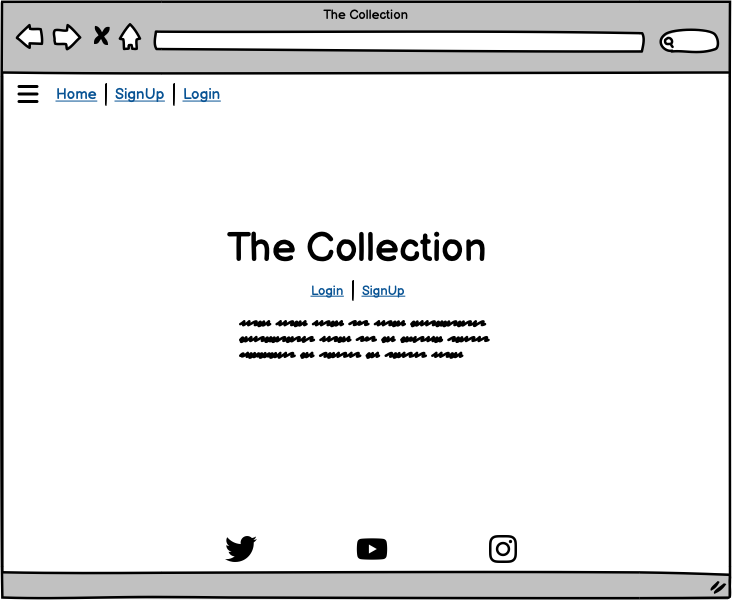
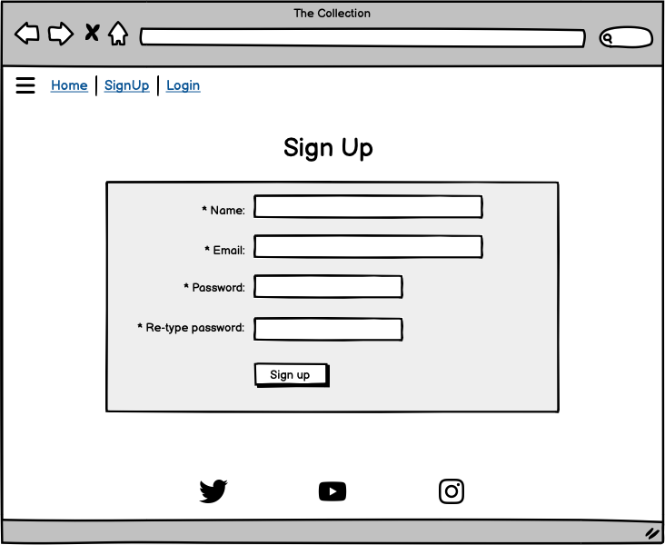
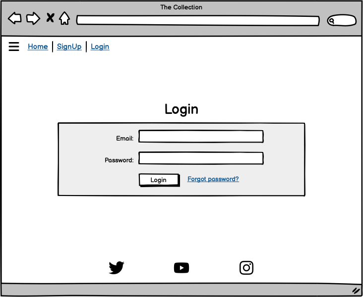
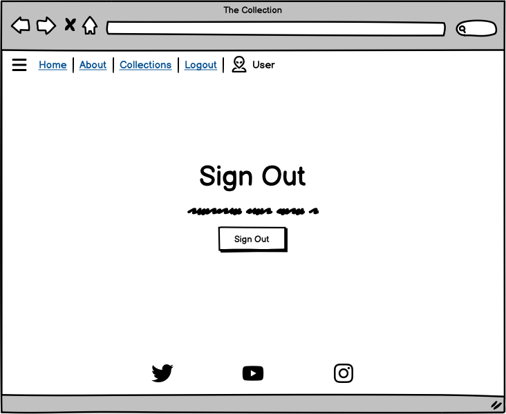
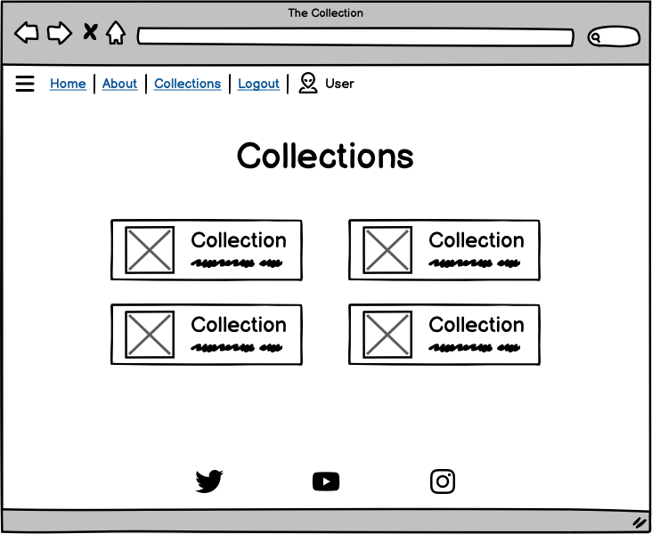
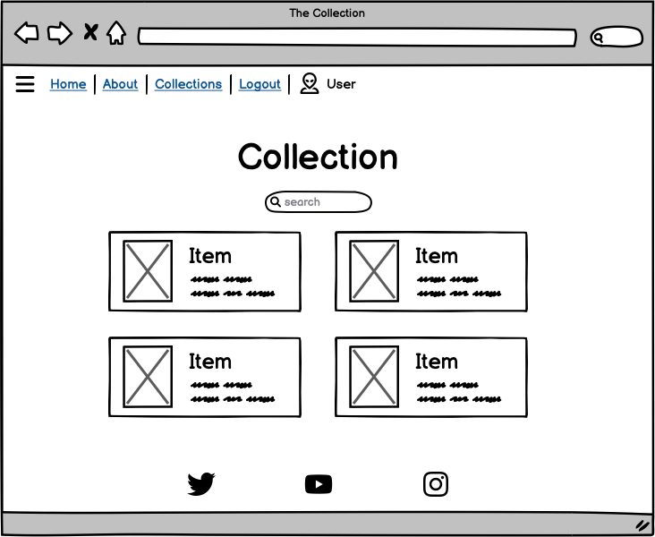
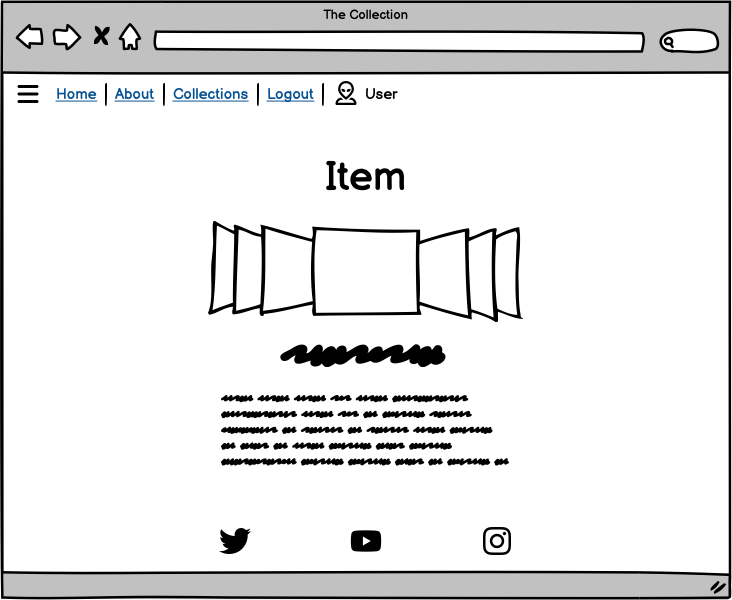
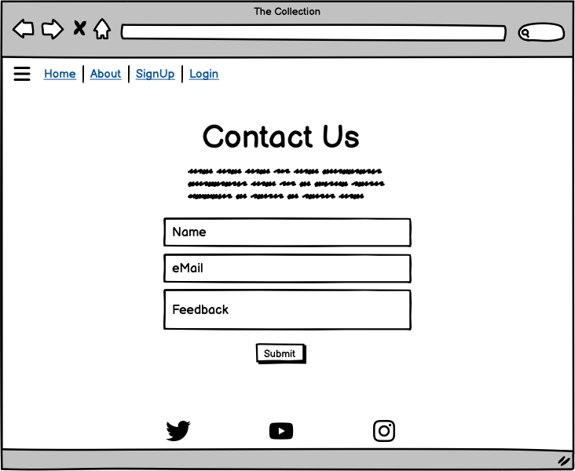
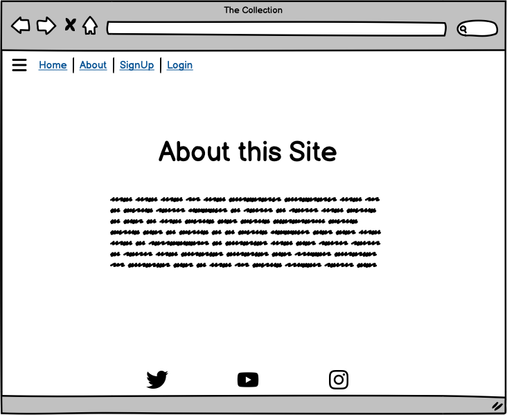
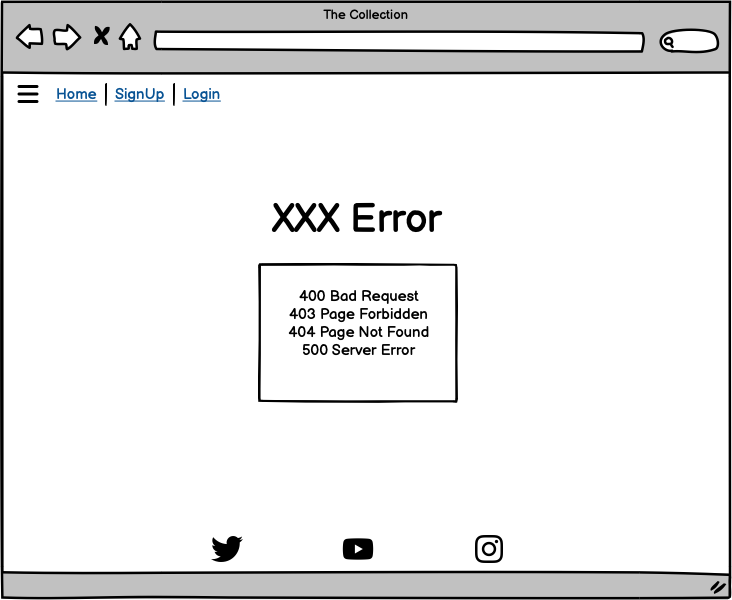

### Data Model

The following ERD (Entity Relationship Diagram) displays the SQL database schema and the associated models, used to create this project. It shows the underlaying fundament of the individual models and their relation to it.
Django AllAuth is used to create a user authentication system.

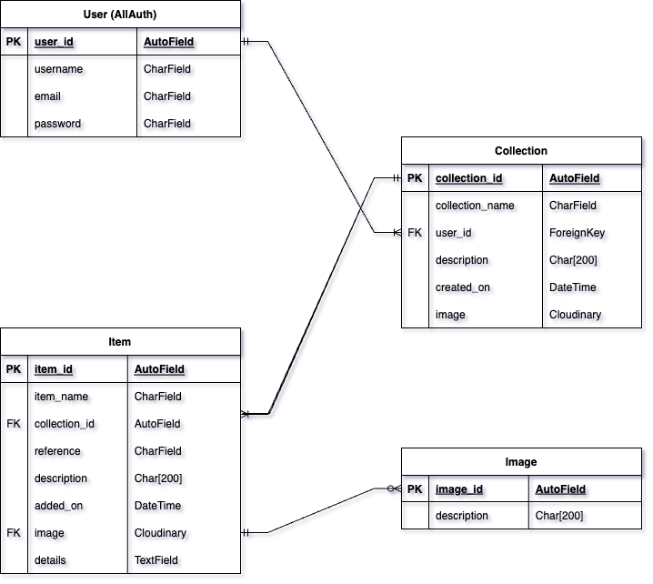

## Features

### Features Left to Implement

- I had to step back from the idea of having multiple images per item, since this has increased the level of complexity for the whole project quite a lot. Since I have to deliver MVP, I will let this feature for future implementation. I had to adapt the db model to reflect this.

---

## Technologies Used
I used the following technologies and resources to create this site:

---

## Development

### Mobile First Approach

### Challenges during Development

### Commit messages

I have decided to mostly use multiline commit messages. Commit messages are an essential part of the whole project and a single line commit message is just not enough to explain. After reading [this interesting article](https://cbea.ms/git-commit/), it was clear to me, that I have to use it.

I have decided to use (mostly) multiline commits, but using tags as described this [cheatsheet](https://cheatography.com/albelop/cheat-sheets/conventional-commits/) or as also described in the LMS of the Code Institute. I did use the following syntax guidline:
- **feat:** for feature which may or may not include a CSS part
- **fix:** for a bugfix
- **style:** for changes to CSS or to give style to the code itself
- **docs:** for changes related to documentation
- **refactor:** for refactored code, re-written code
- **maint:** for general maintenance

---

## Testing
Testing is covered in a separate page, view [TESTING.md](TESTING.md)

## Deployment

### Local Deployment

---

## Credits
### Code

### Content

### Media

### Acknowledgements

