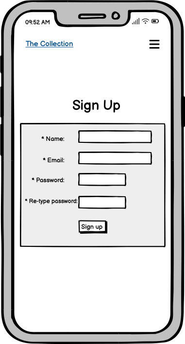
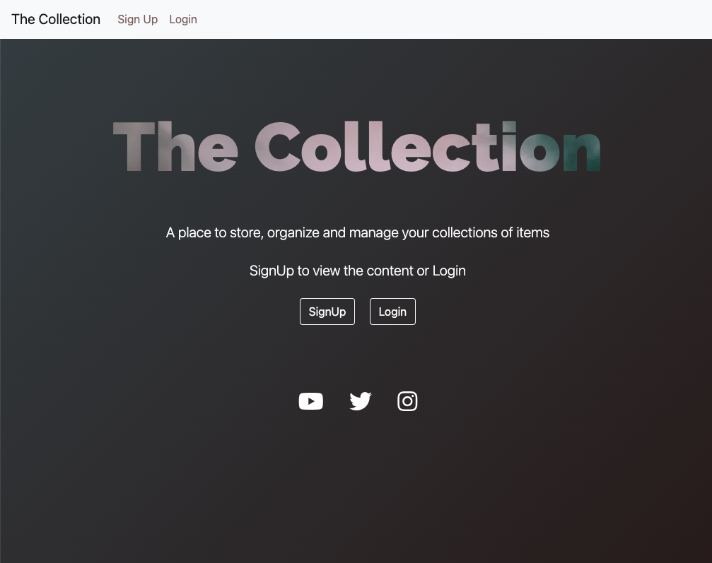
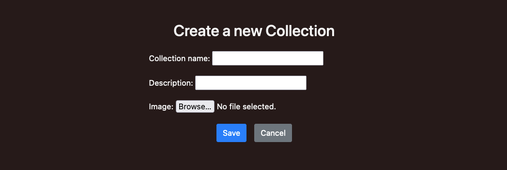
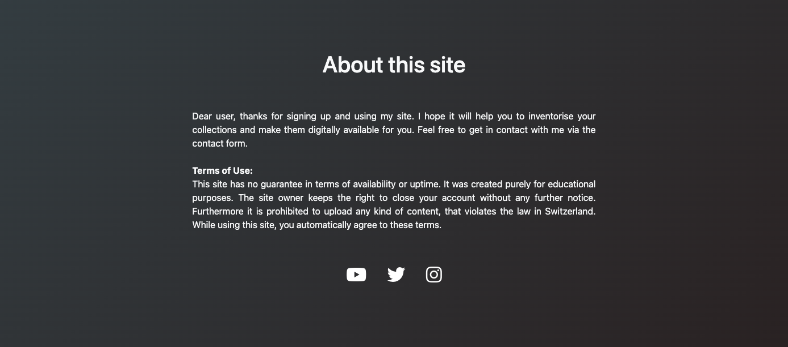

# The Collection
The Collection is a site, which allows a registered user to create and easily manage collections of his beloved items.

The application satisfies the demand for a simple solution, to easily inventory individual things in a beautifully designed cataloge. This can be, for example, a collection of weapons, a collection of model cars or very practical things, such as spare parts for motorcycles. Everything is possible!

A Collection consists of multiple individual items, where each item can be described and images can be uploaded to make the catalog more appealing.
A search function gives the user the possibility to find the item of his desire inside a collection.
    
Link to deployed site: [The Collection](https://the-collection-rpf13.herokuapp.com/)

---

## User Stories

### EPIC - [Mentor Sessions](https://github.com/rpf13/the-collection/issues/14)
- As a Developer I can discuss my concept study for my PP4 app with my mentor so that I get feedback and possible improvements or guidelines in order to actually start coding my app [#15](https://github.com/rpf13/the-collection/issues/15) `(MustHave)`
- As a Developer I can show the status of my PP4 to my mentor so that I can receive valuable feedback and guidance for the rest of the project phase [#16](https://github.com/rpf13/the-collection/issues/16) `(MustHave)`
- As a Developer I can present my finished project and (almost) finished documentation so that I can get valuable feedback of my mentor [#17](https://github.com/rpf13/the-collection/issues/17) `(MustHave)`

### EPIC - [Create Collection & Items](https://github.com/rpf13/the-collection/issues/9)
- As a Developer I can create a Collection model, view & template so that I can save actual data for a new collection and display it [#32](https://github.com/rpf13/the-collection/issues/32) `(MustHave)`
- As a Developer I can create an item(s) model, view & template so that a user can add items to his collections [#33](https://github.com/rpf13/the-collection/issues/33) `(MustHave)`
- As a Developer I can style the collection& items sites in the way that it reflects the overall design. Furthermore, I can update the navigation between the two as well as the rest of the app so that the user has a overall design experience throughout the whole app and can easily navigate between the sections. [#34](https://github.com/rpf13/the-collection/issues/34) `(MustHave)`
- As a Developer I can add a generic image to a catalog and items by default so that **the user has an nice look and feel even though he does not want to upload an image to a collection or item. [#35](https://github.com/rpf13/the-collection/issues/35) `(CouldHave)`
- As a Developer I can create an update & delete model so that a registered user can update or delete one of his collections and all the related items [#51](https://github.com/rpf13/the-collection/issues/51) `(MustHave)`
- As a Developer I can create an update & delete model so that a registered user can update or delete one of his items [#52](https://github.com/rpf13/the-collection/issues/52) `(MustHave)`

### EPIC - [SignUp / Login / SignOout](https://github.com/rpf13/the-collection/issues/8)
- As a user I can register an account so that I can create, update, delete a new collection and the individual items [#23](https://github.com/rpf13/the-collection/issues/23) `(MustHave)`
- As a user I can login & logout of my account so that my account is secured and no one else has access to my collections [#24](https://github.com/rpf13/the-collection/issues/24) `(MustHave)`
- As a user I can see the status of authentication int he navbar so that I can easily see whether I am logged in or not [#25](https://github.com/rpf13/the-collection/issues/25) `(ShouldHave)`

### EPIC - [Admin / User Account Setup](https://github.com/rpf13/the-collection/issues/7)
- As a developer I can create an admin / superuser so that I can login to the django admin panel and will be able to see newly created user profiles [#50](https://github.com/rpf13/the-collection/issues/50) `(MustHave)`

### EPIC - [Base Site / Template Setup](https://github.com/rpf13/the-collection/issues/12)
- As a Developer I can create the base html template so that I can get a default main page and have the base concept / styling for all the subsequent sites [#28](https://github.com/rpf13/the-collection/issues/28) `(MustHave)`
- As a Developer I can add a beautiful glow effect to the "The Collection" site main title so that the user will have a stunning effect, when visiting the main site [#29](https://github.com/rpf13/the-collection/issues/29) `ShouldHave`
- As a Developer I can add the main nav bar to the site so that a user can navigate through all content on the site [#30](https://github.com/rpf13/the-collection/issues/30) `MustHave`
- As a Developer I can update the raw styling of the app so that the site looks nice, is responsive and reflects state of the art guidelines [#53](https://github.com/rpf13/the-collection/issues/53) `MustHave`

### EPIC - [Items Search](https://github.com/rpf13/the-collection/issues/10)
- As a Developer I can create a search functionality inside a collection so that a user can search for items in a easy and very fast way. [#36](https://github.com/rpf13/the-collection/issues/36) `ShouldHave`
- As a Developer I can adjust the collection / items template so that the search field has a central place and has an integrated look and feel to the user so that it is obvious for a user to use the search. [#37](https://github.com/rpf13/the-collection/issues/37) `ShouldHave`

### EPIC - [Contact Us](https://github.com/rpf13/the-collection/issues/11)
- As a Developer I can create a feedback site so that a user can get in contact with the developer / site owner [#38](https://github.com/rpf13/the-collection/issues/38) `ShouldHave`
- As a Developer I can connect / implement the feedback form with a email provider like emailJS so that a user can actually send a real feedback, which the site owner will receive [#39](https://github.com/rpf13/the-collection/issues/39) `ShouldHave`

### EPIC - [About this Site](https://github.com/rpf13/the-collection/issues/13)
- As a Developer I can create an "About this site" page so that a user can understand and read what it is all about including legal aspects of content upload, terms and condition. [#40](https://github.com/rpf13/the-collection/issues/40) `CouldHave`

### EPIC - [Error Handling](https://github.com/rpf13/the-collection/issues/6)
- As a Developer I can create a 403 Unauthorized error page so that so that an unauthorized user gets redirect and receives a useful error page, my views are secured [#41](https://github.com/rpf13/the-collection/issues/41) `MustHave`
- As a Developer I can create a 404 Not found error page so that so that a user gets redirect and receives a useful error page [#42](https://github.com/rpf13/the-collection/issues/42) `MustHave`
- As a Developer I can create a 500 server error page so that so that a user gets redirect and receives a useful error page [#43](https://github.com/rpf13/the-collection/issues/43) `MustHave`

### EPIC - [Automated Testing](https://github.com/rpf13/the-collection/issues/5)
- As a Developer I can create unit testing with django integrated TestCaseClass so that I can execute automated testing and speed up the verification process [#44](https://github.com/rpf13/the-collection/issues/44) `ShouldHave`

### EPIC - [Documentation](https://github.com/rpf13/the-collection/issues/3)
- As a Developer I can create an extensive documentation of the project so that fellow developers can understand each step and part of my app and have the option to easily clone and recreate it [#45](https://github.com/rpf13/the-collection/issues/45) `MustHave`
- As a Developer I can create an extensive testing documentation of the project so that fellow developers can understand each step I have taken to either manually or automatically test my project [#46](https://github.com/rpf13/the-collection/issues/46) `MustHave`

### EPIC - [Final Deployment and Submission](https://github.com/rpf13/the-collection/issues/4)
- As a Developer I can check my finished project code again, including all deployment settings so that I can assure the proper functionality and save deployment on heroku. [#47](https://github.com/rpf13/the-collection/issues/47) `MustHave`
- As a Developer I can submit my final app so that I fulfill the submission date of 31.5.2023 and the CI team can assess my PP4 [#48](https://github.com/rpf13/the-collection/issues/48) `MustHave`

## Stretch User Stories

### EPIC - [Future Features (Stretch Epic)](https://github.com/rpf13/the-collection/issues/49)
- As a Developer I can define future features and improvements so that the app has the option to grow and getting better `WontHave`

    - Add the possibility to have multiple images per item and display it via a carousel
    - Use Social Accounts (Google, Facebook, ...) as part of AllAuth to sign into the app
    - Implement an API to have a web picture search available directly in the image field of the collections / items section
    - Build a feature to share a collection via mail (and possible other ways) with limited rights for the viewer
    - Add the possibility for a shared collection to enable collaboration by the "the others" (very low prio)
    - Add a feature for the image section of the collection / item level, that a user can take an image directly from his smart phone, once logged in and creating a new item
    - Implement a feature to tag, label individual items
    - Enhance the search to a dynamic live search. Will require JS and further modifications.
    - User can update his profile - enhance the profile icon in the navbar with functionality that the user can update, delete his own profile.

---

## UX & Design

The overall design has been kept very simple, kind of industrial design and raw. The main focus should be the content, which is the uploaded image and the description. Everything else should be in the background. Therefore the whole colore scheme is dark, to give the focus to the content - either via the cards containing collections or the item list. The background of the descriptive description inside the card is intentionally white, in order to have immediate focus.

The design is minimalistic, the navigation very intuitive. The background animation is subtile, it does not distract but gives a nice colorful effect, evne though it is kept dark. The main heading of the entry site is an eye catcher, with its transparent text and the moving, dark colored clouds behind it.

---

### Color Scheme

There are different color sets used in this project. Furthermore, the Bootstrap included colors / color classes have been used. I have used [Coolors](https://coolors.co/) to pick and compare the various colors.
I have spent quite some efforts to make sure, all colors and color combinations pass the contrast test, making sure the accessibility is given.
The main font color palete contains the following colors: #F5F5F5 is used as text color, in addition the Bootstrap "text-light" (#F8F9FA). The #C0C0C0 has been used as a replacement for the standard "blue" active link color, in order to give a better contrast on the background. The #343A40 is the standard Bootstrap black. The red, blue and purple colors have been used to highlight the social media fonts, when hovering.

Font Colors

The navbar colors are Bootstrap colors, with the exception of the #3B0707, which has been used as the active link color. Unfortunately the Bootstrap included / default color for this kind of navbar, does not pass the contrast test.

Navbar Colors

The main color-highlight is the animated, gradient background. It contains two base colors and then varies in betweend them.

Background Colors

---

### Typography

- [Google Fonts](https://fonts.google.com/) has served to choose Roboto as the main font and Raleway for the main site's title.
- [Font Awesome](https://fontawesome.com) icons were used throughout the site, such as the social media icons in the footer.

Google Fonts

---

### Wireframes

The Wireframes are the prototype of this project and show the base idea and the skeleton of the app. Some details may change during development. I've used [Balsamiq](https://balsamiq.com/wireframes) to design my site wireframes.

Mobile Wireframe

Desktop Wireframe

---

### Data Model

The following ERD (Entity Relationship Diagram) displays the SQL database schema and the associated models, used to create this project. It shows the underlaying fundament of the individual models and their relation to it.
Django AllAuth is used to create a user authentication system.

---

## Features
### Header

- The header is kept very simple, kept in the background in order to let the user focus on the main entry site. However, it is present and clearly visible with a good contrast.
- The Collection title acts as a link to bring the user to home and it has intentionally no hover effect - changing color.

### Navigation Bar

- The navigation bar is present on each site, either "full screen" or behind a hamburger menu, once the user is on mobile view.
- The navbar is kept simple, the focus of the user should be on the content. However, the colors for the navbar links are choosen in the way to have a clear contrast and are well visible. Teh navigation should be simple and intuitive.
- For an unauthenticated user, the 'Sign Up' and 'Login' links are present
- Once a user is authenticated, he can navigate to his collection via 'My Collections' or create a 'New Collection' via a navbar link.
- The 'Contact', 'About' and 'Logout' links become visible, once a user is authenticated, 'SignUp' and 'Login' will be hidden.
- For an authenticated user, his username is displayed next to a 'User' icon
- Hovering over the links, will change color to black

### Footer

- The Footer consists of the Youtube, Twitter and Instagram FontAwesome icon
- The Footer is only visible on the landing page, the contact and the about page
- Hovering over the icons, will change their color respectively to their original color
- Clicking on them, will open the respective site in a new tab

### Landing Page

- The Landing Page is the main site, the user will see when accessing the site. It is kept simple, very clear and distinct and should immediately attract the user
- One of the main visual features is the transparent title. Behind this 'The Collection' title, an image of colored clouds is moving continuously, implemented via a CSS feature.
- The second visual attracting is the gradient, changing background. It is subtile but clearly visible.
- A short description will explain the purpose of this App as well as guide the user to 'SighUp' or 'Login' in order to access / use the site.

### User Account Pages

Django AllAuth has been installed and the Django templates for SignUp, Login and Logout have been used. The templates were modified in order to match the overall style.

#### SignUp

- SignUp lets the user create a new account
- Once he clicks to create the account, he will be redirected to the site to 'Create a Collection'
- If a user has already an account, there is an active link on the SignUp site to navigate to the Login site

#### Login

- Sign In will bring the user to his content
- If the user does not have an account yet, an active link will let him navigate to the SignUp site

#### Logout

- Logout lets the user Sign Out, asking for confirmation to do so.
- Cancel button will bring him back to his content.

### My Collections

#### Collection List

- My collections is the place to display the various collections of a user.
- For first time users, after they have signed up, they are redirected to the site, where they get informed that they do not have a collection yet, offering the button to create a collection.
- Returning users will see a list of their collections, displayed with multiple cards, each card containing a collection.
- The description text of a collection is truncated, will be shown in full on the collection detail view
- Existing collections provide navigations buttons to view, update and delete, where as the delete button is highlighted red, in order to show the "danger"
- The cards are fully responsive and align on desktop as well as mobile dynamically
- the last added / edited collection is displayed first
- For returning users, the 'New Collection' button is intentionally kept in the navigation bar, this for a few reasons:
    - The Collection overview should be as simplistic as possible, no distraction from the individual cards
    - New collections will not be created that often, therefore a button does not to be very prominent
    - The Navbar is also sleek therefore, the 'New Colection' button can easily be found

#### New Collection

- New Collection button will bring the user to the form to create a new collection
- User can add title, description and an image. If he does not add a custom image, a default image will be added in form of colored clouds
- Save and Cancel button are present, where as the cancel button brings the user back to the collection list

#### Collection Update

- The Update button on a collection card will bring the user to the 'Collection Update' site
- The user has the change to change all fields, including a replacement of the default image (if he did not add a custom image in the first place)
- The save button will store the changes, cancel button will bring him back to the collection list

#### Collection Delete

- The Collection Delete button will bring the user to the collection delete form
- It will ask again, if the user really wants to delete his collection with all items
- Confirmation will delete the collection and all items, cancel brings him back to the list

#### Collection Details

- When the user clicks on the view button of a collection in the card, he will be shown the details
- If a collection has no items in in yet, only the title of the collection including the details of the description will be presented, in combination with a descriptive text and a button to create an item.
- If there are items in a collection, they will be presented inside cards. The cards have the same look and feel like the collection cards.
- The detail description text will be shown underneath the colection title
- The individual items are shown, paginated, with a maximum of 6 per site. Prev / Next button is displayed on the bottom in case pagination kicks in. The last added / edited item is displayed first.
- Navigation buttons for 'Add Item', 'Edit Collection' and 'My Collections' are displayed
- A Search field is shown to let the user search if he has large collections
- Search will search in title and description fields of an item

- If the search was not successful, it will display a text and provide a button to cancel and return to the colelction list.

#### Item Create

- The 'Create a new item' / 'Add item' buttons will navigate the user to the create item form and let the user add a new item with a name, description and a freeform text field.
- The user has the option to upload an image and if he leaves that blank, a default abstract image will be used
- Save and Cancel button are in place, where as the latter one brings the user back to the collection

#### Item Update

- The 'Update' / 'Edit' button will bring the user to the edit form of the item
- He can change all fields of an item, including the replacement of the default image with a custom one
- Save changes and cancel button are available

#### Item Delete

- The 'Delete' button in the item card or the item detail site will navigate the user to the item delete form
- User will be prompted if he is really sure to delete the item
- Final delete and cancel buttons are in place

#### Item Detail

- The item detail site gives the user the most detailed view about an item. The item title is displayed above the image.
- The collection name to which it belogs to is shown, alongside the date, when it was added as well as the free form text.
- Navigation elements like 'Edit' 'Back to collection' and 'Delete' button are available.
- The 'Delete' button is intentionally not outlined in red, like all the other delete buttons, because this would break the contrast accessibility test. A complete red button would distract the user from the main content, therefore it is kept outlined in white.

### Contact Site

- The Contact link directs the user to the contact form. It is intentionally implemented only for registered users.
- It provides a simple form to get in contact with the site owner.
- Behind the scenes, it is linked to [Mailtrap.io](https://mailtrap.io), which is a very great plattform for testing out mail services. The mail get's received in mailtrap.io and can be further processed (sent automatically to a destination among other options.)

### About Site

- The About site is a simple site, giving some background infos for the project. Furthermore, I wanted to add a terms of use section, since I am the site owner and a potential user is able to upload content and make it available in the World Wide Web.

---

## Features Left to Implement

The following section will give an overview about the features, which are planned in future interations.

- I had to step back from the idea of having multiple images per item, since this has increased the level of complexity for the whole project quite a lot. Since I have to deliver MVP, I will let this feature for future implementation. I had to adapt the db model to reflect this.
- Add the possibility to have multiple images per item and display it via a carousel
- Use Social Accounts (Google, Facebook, ...) as part of AllAuth to sign into the app
- Implement an API to have a web picture search available directly in the image field of the collections / items section
- Build a feature to share a collection via mail (and possible other ways) with limited rights for the viewer
- Add the possibility for a shared collection to enable collaboration by the "the others" (very low prio)
- Add a feature for the image section of the collection / item level, that a user can take an image directly from his smart phone, once logged in and creating a new item
- Implement a feature to tag, label individual items
- Enhance the search to a dynamic live search. Will require JS and further modifications.
- User can update his profile - enhance the profile icon in the navbar with functionality that the user can update, delete his own profile.

---

## Tools & Technologies Used

I used the following technologies and resources to create this site:

- [HTML](https://en.wikipedia.org/wiki/HTML) used for the main site content.
- [CSS](https://en.wikipedia.org/wiki/CSS) used for the main site design and layout.
- [Python](https://www.python.org) used as the back-end programming language.
- [Git](https://git-scm.com) used for version control. (`git add`, `git commit`, `git push`)
- [GitHub](https://github.com) used for secure online code storage.
- [Gitpod](https://gitpod.io) used as a cloud-based IDE for development.
- [Bootstrap](https://getbootstrap.com) used as the front-end CSS framework for modern responsiveness and pre-built components.
- [Django](https://www.djangoproject.com) used as the Python framework for the site.
- [PostgreSQL](https://www.postgresql.org) used as the relational database management.
- [ElephantSQL](https://www.elephantsql.com) used as the Postgres database.
- [Heroku](https://www.heroku.com) used for hosting the deployed back-end site.
- [Cloudinary](https://cloudinary.com) used for dynamic file storage for collection & item images.
- [Whitenoise](https://whitenoise.readthedocs.io/en/latest/) used for static file storage
- [PostgreSQL](https://www.postgresql.org) used as the relational database management.
- [ElephantSQL](https://www.elephantsql.com) used as the Postgres database.
- [Heroku](https://www.heroku.com) used for hosting the deployed back-end site.
- [Techsini](https://techsini.com/) used to create the mockup image used in my readme.
- [WebAIM Contrast Checker](https://webaim.org/resources/contrastchecker/) used to check contrast between colours on the site
- [Balsamiq](https://balsamiq.com/wireframes) used to design my site wireframes.
- [TinyWow](https://tinywow.com/image/jpg-to-webp) used to compress images & transform to other formats
- [Mailtrap](https://mailtrap.io) used as the backend for sending mails via contact form
- [Unsplash](https://unsplash.com) used to get default and background images
- [Favicon.io](https://favicon.io/emoji-favicons/alien/) used to get the favicon

---

## Development

The following chapters describe why and how I have choosen to code certain parts the way they are. This section should give an explanation to my thinking process and explain the reader some conceptual decisions.

### Mobile First Approach

The app was planned in a mobile first thinking process. It should be a fully responsive app, which looks great on mobile devices but also on desktop. Bootstrap elements really help, for example in the form of the navigation bar, colapsing the elements into a hamburger menu.
Other parts are chosen in the way, that the look great on mobile and on desktop. For example the buttons were chosen in a size, which will suit all formats.
Nervertless, some elements did have to get some adjustments via very minimal usage of media queries. 

---

### Challenges during Development

My biggest challenge during this project was to get a better understanding of Django. Django is really a very powerful tool, "Batteries included" framework, which makes it sometimes difficult to get along all possibilities. I have spent endless hours in reading documentation.
My aim was to create something completely new, I wanted an app which makes sense and serves a purpose. I did choose to create this app, because this is something I always wanted, an app to inventorise my collection of things. 
Furthermore, I wanted to use Class Based Views. I was thinking, that should be easily doable but it turned out to be much more tricky than I though. For example I could not make the error sites work using only class based views. So I had to adapt that part to function based views.
Since I truly love minimalistic and industrial design, it was clear to me, that the app has to be built that ways. I am very happy with the outcome and I am looking forward to implement the additional features in future increments.

---

### Commit messages

I have decided to mostly use multiline commit messages. Commit messages are an essential part of the whole project and a single line commit message is just not enough to explain. After reading [this interesting article](https://cbea.ms/git-commit/), it was clear to me, that I have to use it.

I have decided to use (mostly) multiline commits, but using tags as described this [cheatsheet](https://cheatography.com/albelop/cheat-sheets/conventional-commits/) or as also described in the LMS of the Code Institute. I did use the following syntax guidline:
- **feat:** for feature which may or may not include a CSS part
- **fix:** for a bugfix
- **style:** for changes to CSS or to give style to the code itself
- **docs:** for changes related to documentation
- **refactor:** for refactored code, re-written code
- **maint:** for general maintenance

---

## Agile Development Process

### GitHub Projects
[Github Projects](https://github.com/users/rpf13/projects/3) has been used as the Agile tool during the development phase of this project. The Kanban board was very useful to keep track on the tasks. I have created 4 columns (Epics, ToDo, In Progress, On Hold, Done) and moved the stories accordingly. The Epics column has been very helpful to see all main objectives. The On Hold column has served as a "parking spaces", when a story was partially done, but not completely finished.

### GitHub Issues
[Github Issues](https://github.com/rpf13/the-collection/issues) has been used to create all the stories, before they were placed on the projects Kanban board. I have create two templates, one for Epics and one for Stories.
Each Epic and all the related stories have an epic label, which makes it very easy to filter for all tasks, related to one epic. Simply click on the label, while being in the Kanban board. Epics do also have a dedicated label called Epic, which makes it easy to filter all epics.
Once a story has been created via the template, it will be automatically added to the Kanban board in the Todo column.

### MoSCoW Prioritization
The MoSCoW prioritization has been used to divide all epics and stories into the following categories:

- **MustHave:** guaranteed to be delivered
- **ShouldHave:** adds significant value, but not mandatory for MVP
- **CouldHave:** adds value, would be nice to have
- **WontHave:** no priority for this iteration, acts as placeholder for future implementation

A related Github label has been created for each category and added to each epic, story - which makes it easy to identify and see the value it brings.

---

## Testing
Testing is covered in a separate page, view [TESTING.md](TESTING.md)

---

## Deployment

---

### Local Deployment

---

## Credits

---

### Code

---

### Content

---

### Media

---

### Acknowledgements

