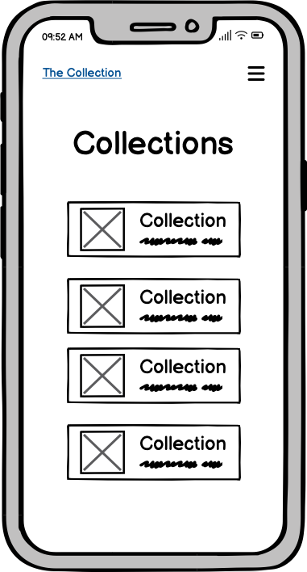
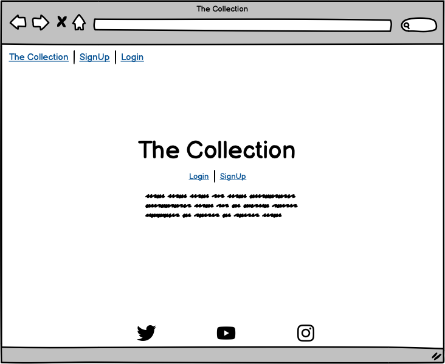

# The Collection
The Collection is a site, which allows a registered user to create and easily manage collections of his beloved items.

The application satisfies the demand for a simple solution, to easily inventory individual things in a beautifully designed cataloge. This can be, for example, a collection of weapons, a collection of model cars or very practical things, such as spare parts for motorcycles. Everything is possible!

A Collection consists of multiple individual items, where each item can be described and images can be uploaded to make the catalog more appealing.
A search function gives the user the possibility to find the item of his desire inside a collection.
    
Link to deployed site: [The Collection](https://the-collection-rpf13.herokuapp.com/)

---

## User Stories

### EPIC - [Mentor Sessions](https://github.com/rpf13/the-collection/issues/14)
- As a Developer I can discuss my concept study for my PP4 app with my mentor so that I get feedback and possible improvements or guidelines in order to actually start coding my app [#15](https://github.com/rpf13/the-collection/issues/15) `(MustHave)`
- As a Developer I can show the status of my PP4 to my mentor so that I can receive valuable feedback and guidance for the rest of the project phase [#16](https://github.com/rpf13/the-collection/issues/16) `(MustHave)`
- As a Developer I can present my finished project and (almost) finished documentation so that I can get valuable feedback of my mentor [#17](https://github.com/rpf13/the-collection/issues/17) `(MustHave)`

### EPIC - [Create Collection & Items](https://github.com/rpf13/the-collection/issues/9)
- As a Developer I can create a Collection model, view & template so that I can save actual data for a new collection and display it [#32](https://github.com/rpf13/the-collection/issues/32) `(MustHave)`
- As a Developer I can create an item(s) model, view & template so that a user can add items to his collections [#33](https://github.com/rpf13/the-collection/issues/33) `(MustHave)`
- As a Developer I can style the collection& items sites in the way that it reflects the overall design. Furthermore, I can update the navigation between the two as well as the rest of the app so that the user has a overall design experience throughout the whole app and can easily navigate between the sections. [#34](https://github.com/rpf13/the-collection/issues/34) `(MustHave)`
- As a Developer I can add a generic image to a catalog and items by default so that **the user has an nice look and feel even though he does not want to upload an image to a collection or item. [#35](https://github.com/rpf13/the-collection/issues/35) `(CouldHave)`
- As a Developer I can create an update & delete model so that a registered user can update or delete one of his collections and all the related items [#51](https://github.com/rpf13/the-collection/issues/51) `(MustHave)`
- As a Developer I can create an update & delete model so that a registered user can update or delete one of his items [#52](https://github.com/rpf13/the-collection/issues/52) `(MustHave)`

### EPIC - [SignUp / Login / SignOout](https://github.com/rpf13/the-collection/issues/8)
- As a user I can register an account so that I can create, update, delete a new collection and the individual items [#23](https://github.com/rpf13/the-collection/issues/23) `(MustHave)`
- As a user I can login & logout of my account so that my account is secured and no one else has access to my collections [#24](https://github.com/rpf13/the-collection/issues/24) `(MustHave)`
- As a user I can see the status of authentication int he navbar so that I can easily see whether I am logged in or not [#25](https://github.com/rpf13/the-collection/issues/25) `(ShouldHave)`

### EPIC - [Admin / User Account Setup](https://github.com/rpf13/the-collection/issues/7)
- As a developer I can create an admin / superuser so that I can login to the django admin panel and will be able to see newly created user profiles [#50](https://github.com/rpf13/the-collection/issues/50) `(MustHave)`

### EPIC - [Base Site / Template Setup](https://github.com/rpf13/the-collection/issues/12)
- As a Developer I can create the base html template so that I can get a default main page and have the base concept / styling for all the subsequent sites [#28](https://github.com/rpf13/the-collection/issues/28) `(MustHave)`
- As a Developer I can add a beautiful glow effect to the "The Collection" site main title so that the user will have a stunning effect, when visiting the main site [#29](https://github.com/rpf13/the-collection/issues/29) `ShouldHave`
- As a Developer I can add the main nav bar to the site so that a user can navigate through all content on the site [#30](https://github.com/rpf13/the-collection/issues/30) `MustHave`
- As a Developer I can update the raw styling of the app so that the site looks nice, is responsive and reflects state of the art guidelines [#53](https://github.com/rpf13/the-collection/issues/53) `MustHave`

### EPIC - [Items Search](https://github.com/rpf13/the-collection/issues/10)
- As a Developer I can create a search functionality inside a collection so that a user can search for items in a easy and very fast way. [#36](https://github.com/rpf13/the-collection/issues/36) `ShouldHave`
- As a Developer I can adjust the collection / items template so that the search field has a central place and has an integrated look and feel to the user so that it is obvious for a user to use the search. [#37](https://github.com/rpf13/the-collection/issues/37) `ShouldHave`

### EPIC - [Contact Us](https://github.com/rpf13/the-collection/issues/11)
- As a Developer I can create a feedback site so that a user can get in contact with the developer / site owner [#38](https://github.com/rpf13/the-collection/issues/38) `ShouldHave`
- As a Developer I can connect / implement the feedback form with a email provider like emailJS so that a user can actually send a real feedback, which the site owner will receive [#39](https://github.com/rpf13/the-collection/issues/39) `ShouldHave`

### EPIC - [About this Site](https://github.com/rpf13/the-collection/issues/13)
- As a Developer I can create an "About this site" page so that a user can understand and read what it is all about including legal aspects of content upload, terms and condition. [#40](https://github.com/rpf13/the-collection/issues/40) `CouldHave`

### EPIC - [Error Handling](https://github.com/rpf13/the-collection/issues/6)
- As a Developer I can create a 403 Unauthorized error page so that so that an unauthorized user gets redirect and receives a useful error page, my views are secured [#41](https://github.com/rpf13/the-collection/issues/41) `MustHave`
- As a Developer I can create a 404 Not found error page so that so that a user gets redirect and receives a useful error page [#42](https://github.com/rpf13/the-collection/issues/42) `MustHave`
- As a Developer I can create a 500 server error page so that so that a user gets redirect and receives a useful error page [#43](https://github.com/rpf13/the-collection/issues/43) `MustHave`

### EPIC - [Automated Testing](https://github.com/rpf13/the-collection/issues/5)
- As a Developer I can create unit testing with django integrated TestCaseClass so that I can execute automated testing and speed up the verification process [#44](https://github.com/rpf13/the-collection/issues/44) `ShouldHave`

### EPIC - [Documentation](https://github.com/rpf13/the-collection/issues/3)
- As a Developer I can create an extensive documentation of the project so that fellow developers can understand each step and part of my app and have the option to easily clone and recreate it [#45](https://github.com/rpf13/the-collection/issues/45) `MustHave`
- As a Developer I can create an extensive testing documentation of the project so that fellow developers can understand each step I have taken to either manually or automatically test my project [#46](https://github.com/rpf13/the-collection/issues/46) `MustHave`

### EPIC - [Final Deployment and Submission](https://github.com/rpf13/the-collection/issues/4)
- As a Developer I can check my finished project code again, including all deployment settings so that I can assure the proper functionality and save deployment on heroku. [#47](https://github.com/rpf13/the-collection/issues/47) `MustHave`
- As a Developer I can submit my final app so that I fulfill the submission date of 31.5.2023 and the CI team can assess my PP4 [#48](https://github.com/rpf13/the-collection/issues/48) `MustHave`

## Stretch User Stories

### EPIC - [Future Features (Stretch Epic)](https://github.com/rpf13/the-collection/issues/49)
- As a Developer I can define future features and improvements so that the app has the option to grow and getting better `WontHave`

    - Add the possibility to have multiple images per item and display it via a carousel
    - Use Social Accounts (Google, Facebook, ...) as part of AllAuth to sign into the app
    - Implement an API to have a web picture search available directly in the image field of the collections / items section
    - Build a feature to share a collection via mail (and possible other ways) with limited rights for the viewer
    - Add the possibility for a shared collection to enable collaboration by the "the others" (very low prio)
    - Add a feature for the image section of the collection / item level, that a user can take an image directly from his smart phone, once logged in and creating a new item
    - Implement a feature to tag, label individual items
    - Enhance the search to a dynamic live search. Will require JS and further modifications.
    - User can update his profile - enhance the profile icon in the navbar with functionality that the user can update, delete his own profile.

---

## UX & Design

The overall design has been kept very simple, kind of industrial design and raw. The main focus should be the content, which is the uploaded image and the description. Everything else should be in the background. Therefore the whole colore scheme is dark, to give the focus to the content - either via the cards containing collections or the item list. The background of the descriptive description inside the card is intentionally white, in order to have immediate focus.

The design is minimalistic, the navigation very intuitive. The background animation is subtile, it does not distract but gives a nice colorful effect, evne though it is kept dark. The main heading of the entry site is an eye catcher, with its transparent text and the moving, dark colored clouds behind it.

---

### Color Scheme

There are different color sets used in this project. Furthermore, the Bootstrap included colors / color classes have been used. I have used [Coolors](https://coolors.co/) to pick and compare the various colors.
I have spent quite some efforts to make sure, all colors and color combinations pass the contrast test, making sure the accessibility is given.
The main font color palete contains the following colors: #F5F5F5 is used as text color, in addition the Bootstrap "text-light" (#F8F9FA). The #C0C0C0 has been used as a replacement for the standard "blue" active link color, in order to give a better contrast on the background. The #343A40 is the standard Bootstrap black. The red, blue and purple colors have been used to highlight the social media fonts, when hovering.

Font Colors

The navbar colors are Bootstrap colors, with the exception of the #3B0707, which has been used as the active link color. Unfortunately the Bootstrap included / default color for this kind of navbar, does not pass the contrast test.

Navbar Colors

The main color-highlight is the animated, gradient background. It contains two base colors and then varies in betweend them.

Background Colors

---

### Typography

[Google Fonts](https://fonts.google.com/) has served to choose Roboto as the main font and Raleway for the main site's title.

Fonts

---

### Wireframes

The Wireframes are the prototype of this project and show the base idea and the skeleton of the app. Some details may change during development.

Mobile Wireframe

Desktop Wireframe

---

### Data Model

The following ERD (Entity Relationship Diagram) displays the SQL database schema and the associated models, used to create this project. It shows the underlaying fundament of the individual models and their relation to it.
Django AllAuth is used to create a user authentication system.

---

## Features

---

### Features Left to Implement

- I had to step back from the idea of having multiple images per item, since this has increased the level of complexity for the whole project quite a lot. Since I have to deliver MVP, I will let this feature for future implementation. I had to adapt the db model to reflect this.

---

## Technologies Used
I used the following technologies and resources to create this site:

---

## Development

---

### Mobile First Approach

---

### Challenges during Development

---

### Commit messages

I have decided to mostly use multiline commit messages. Commit messages are an essential part of the whole project and a single line commit message is just not enough to explain. After reading [this interesting article](https://cbea.ms/git-commit/), it was clear to me, that I have to use it.

I have decided to use (mostly) multiline commits, but using tags as described this [cheatsheet](https://cheatography.com/albelop/cheat-sheets/conventional-commits/) or as also described in the LMS of the Code Institute. I did use the following syntax guidline:
- **feat:** for feature which may or may not include a CSS part
- **fix:** for a bugfix
- **style:** for changes to CSS or to give style to the code itself
- **docs:** for changes related to documentation
- **refactor:** for refactored code, re-written code
- **maint:** for general maintenance

---

## Agile Development Process

### GitHub Projects

### GitHub Issues

### MoSCoW Prioritization

---

## Testing
Testing is covered in a separate page, view [TESTING.md](TESTING.md)

---

## Deployment

---

### Local Deployment

---

## Credits

---

### Code

---

### Content

---

### Media

---

### Acknowledgements

