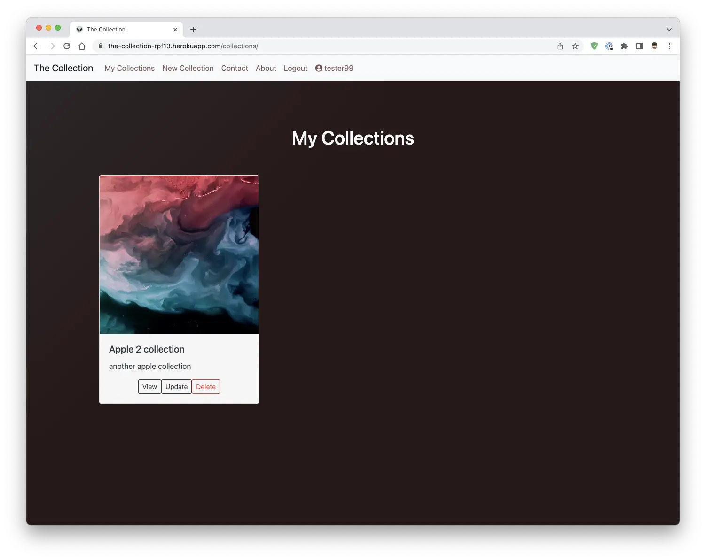
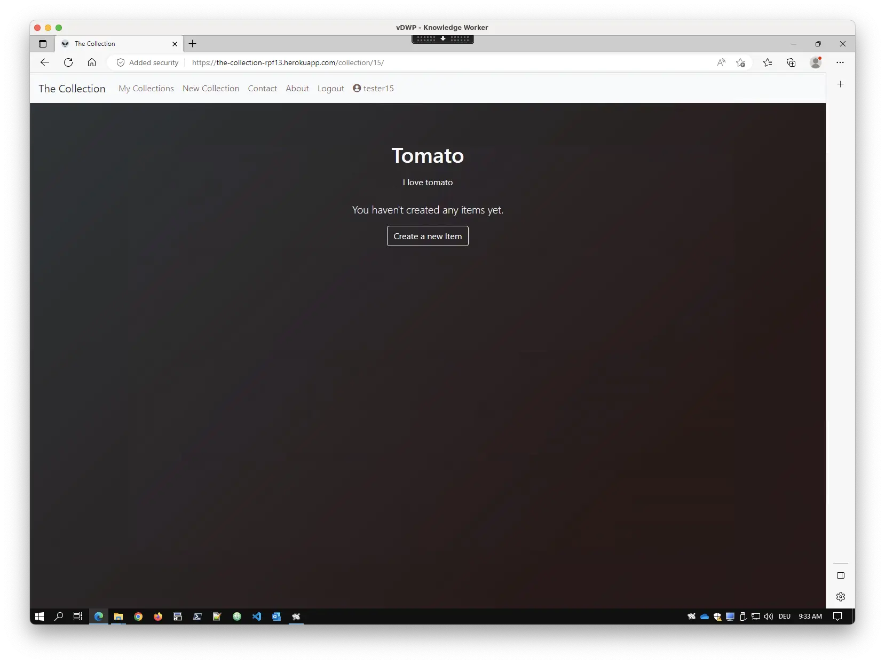
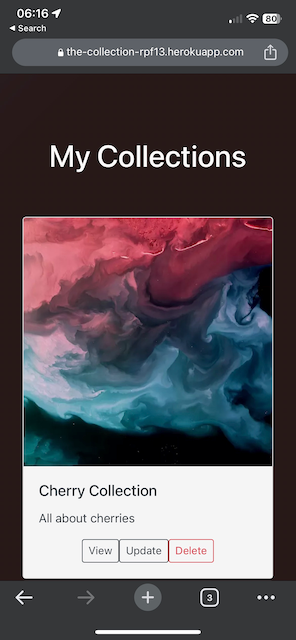
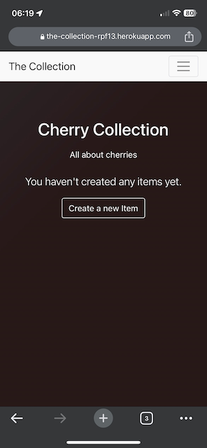
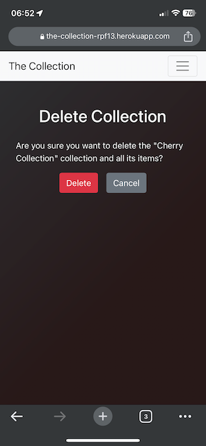
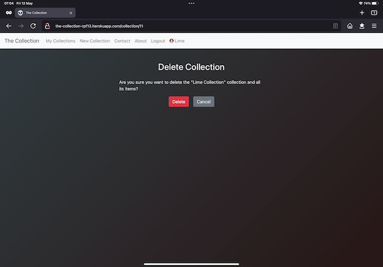
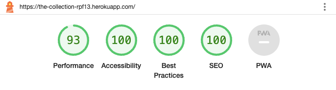

# Testing

Return back to the [README.md](README.md) file.

---

## Code Validation

### HTML

I have used the recommended [HTML W3C Validator](https://validator.w3.org) to validate all of my HTML files.

As my project uses Jinja syntax, such as ``, ``, and `{{ variable|filter }}`
it will not validate properly if I copy and paste into the HTML validator straight from my source files.

Usually in order to properly validate these types of files, it's recommended to
[validate by uri](https://validator.w3.org/#validate_by_uri) from the deployed Heroku pages.

Unfortunately, nearly all of the pages on this site require a user to be logged-in and authenticated,
and will not work using this method, due to the fact that the HTML Validator (W3C) doesn't have
access to login to the pages.

In order to properly validate my HTML pages with Jinja syntax for authenticated pages, I followed these steps:

- Navigate to the deployed pages which require authentication
- Right-click anywhere on the page, and select **View Page Source** (usually `CTRL+U` or `⌘+U` on Mac).
- This will display the entire "compiled" code, without any Jinja syntax.
- Copy everything, and use the [validate by input](https://validator.w3.org/#validate_by_input) method.
- Repeat this process for every page that requires a user to be logged-in/authenticated.

In the following table, all W3C testing is presented with snapshots.

W3C Validation Table with Snapshots

| Page | W3C URL | Screenshot | Notes |
| --- | --- | --- | --- |
| Home | [W3C](https://validator.w3.org/nu/?doc=https%3A%2F%2Fthe-collection-rpf13.herokuapp.com%2F) |  | No Errors / Warnings |
| SignUp | [W3C](https://validator.w3.org/nu/?doc=https%3A%2F%2Fthe-collection-rpf13.herokuapp.com%2Faccounts%2Fsignup%2F) |  | No Errors / Warnings |
| Login | [W3C](https://validator.w3.org/nu/?doc=https%3A%2F%2Fthe-collection-rpf13.herokuapp.com%2Faccounts%2Flogin%2F) |  | No Errors / Warnings |
| Collections (List) | n/a |  | No Errors / Warnings |
| Collection New | n/a |  | No Errors / Warnings |
| Collection Detail | n/a |  | No Errors / Warnings |
| Collection Detail Empty | n/a |  | No Errors / Warnings |
| Collection Update | n/a |  | No Errors / Warnings |
| Collection | Delete |  | No Errors / Warnings |
| Item Add | n/a |  | No Errors / Warnings |
| Item Update | n/a |  | No Errors / Warnings |
| Item Delete | n/a |  | No Errors / Warnings |
| Item Detail | n/a |  | No Errors / Warnings |
| Item Search Successful | n/a |  | No Errors / Warnings |
| Item Search False | n/a |  | No Errors / Warnings |
| Contact Form | n/a |  | No Errors / Warnings |
| Contact Form Confirmation | n/a |  | No Errors / Warnings |
| About | n/a |  | No Errors / Warnings |
| Logout | n/a |  | No Errors / Warnings |

---

### CSS

I have used the recommended [CSS Jigsaw Validator](https://jigsaw.w3.org/css-validator) to validate my CSS files.

| File | Jigsaw URL | Screenshot | Notes |
| --- | --- | --- | --- |
| style.css | [Jigsaw](http://jigsaw.w3.org/css-validator/validator?lang=en&profile=css3svg&uri=https%3A%2F%2Fthe-collection-rpf13.herokuapp.com%2F&usermedium=all&vextwarning=&warning=1) |  | Pass: No Errors |

---

### Python

I have used the recommended [CI Python Linter](https://pep8ci.herokuapp.com) to validate all of my Python files.

CI Python Linter Validation Table with Snapshots

| File | CI URL | Screenshot | Notes |
| --- | --- | --- | --- |
| main settings.py | [CI PEP8](https://pep8ci.herokuapp.com/https://raw.githubusercontent.com/rpf13/the-collection/main/main/settings.py) |  | Pass: No Errors |
| main urls.py | [CI PEP8](https://pep8ci.herokuapp.com/https://raw.githubusercontent.com/rpf13/the-collection/main/main/urls.py) |  | Pass: No Errors |
| main views.py | [CI PEP8](https://pep8ci.herokuapp.com/https://raw.githubusercontent.com/rpf13/the-collection/main/main/views.py) |  | Pass: No Errors |
| collection admin.py | [CI PEP8](https://pep8ci.herokuapp.com/https://raw.githubusercontent.com/rpf13/the-collection/main/collection/admin.py) |  | Pass: No Errors |
| collection apps.py | [CI PEP8](https://pep8ci.herokuapp.com/https://raw.githubusercontent.com/rpf13/the-collection/main/collection/apps.py) |  | Pass: No Errors |
| collection models.py | [CI PEP8](https://pep8ci.herokuapp.com/https://raw.githubusercontent.com/rpf13/the-collection/main/collection/models.py) |  | Pass: No Errors |
| collection tests.py | [CI PEP8](https://pep8ci.herokuapp.com/https://raw.githubusercontent.com/rpf13/the-collection/main/collection/tests.py) |  | Pass: No Errors |
| collection urls.py | [CI PEP8](https://pep8ci.herokuapp.com/https://raw.githubusercontent.com/rpf13/the-collection/main/collection/urls.py) |  | Pass: No Errors |
| collection views.py | [CI PEP8](https://pep8ci.herokuapp.com/https://raw.githubusercontent.com/rpf13/the-collection/main/collection/views.py) |  | Pass: No Errors |
| contact apps.py | [CI PEP8](https://pep8ci.herokuapp.com/https://raw.githubusercontent.com/rpf13/the-collection/main/contact/apps.py) |  | Pass: No Errors |
| contact forms.py | [CI PEP8](https://pep8ci.herokuapp.com/https://raw.githubusercontent.com/rpf13/the-collection/main/contact/forms.py) |  | Pass: No Errors |
| contact urls.py | [CI PEP8](https://pep8ci.herokuapp.com/https://raw.githubusercontent.com/rpf13/the-collection/main/contact/urls.py) |  | Pass: No Errors |
| contact views.py | [CI PEP8](https://pep8ci.herokuapp.com/https://raw.githubusercontent.com/rpf13/the-collection/main/contact/views.py) |  | Pass: No Errors |

---

## Browser Compatibility

I've tested my deployed project on multiple browsers to check for compatibility issues.
I have tested it on Chrome and Safari on OSX and Edge in Windows 10.
Please note that in addition to these desktop tests, there are also tests done in the responsiveness section with Chrome on iOS and Firefox on iPadOS.

In the table below you can find snapshots of each browser. I did a "walkthrough" of the most important features / workflow, which a user would execute.

Browser Compatibility Testing Table with Snapshots

| Browser | OS | Screenshot | Notes |
| --- | --- | --- | --- |
| Chrome | OSX |  | Works as expected |
| Chrome | OSX |  | Works as expected |
| Chrome | OSX |  | Works as expected |
| Chrome | OSX |  | Works as expected |
| Chrome | OSX |  | Works as expected |
| Chrome | OSX |  | Works as expected |
| Chrome | OSX |  | Works as expected |
| Chrome | OSX |  | Works as expected |
| Chrome | OSX |  | Works as expected |
| Chrome | OSX |  | Works as expected |
| Chrome | OSX |  | Works as expected |
| Chrome | OSX |  | Works as expected |
| Chrome | OSX |  | Works as expected |
| Chrome | OSX |  | Works as expected |
| Chrome | OSX |  | Works as expected |
| Chrome | OSX |  | Works as expected |
| Safari | OSX |  | Works as expected |
| Safari | OSX |  | Works as expected |
| Safari | OSX |  | Works as expected |
| Safari | OSX |  | Works as expected |
| Safari | OSX |  | Works as expected |
| Safari | OSX |  | Works as expected |
| Safari | OSX |  | Works as expected |
| Safari | OSX |  | Works as expected |
| Safari | OSX |  | Works as expected |
| Safari | OSX |  | Works as expected |
| Safari | OSX |  | Works as expected |
| Safari | OSX |  | Works as expected |
| Safari | OSX |  | Works as expected |
| Safari | OSX |  | Works as expected |
| Safari | OSX |  | Works as expected |
| Safari | OSX |  | Works as expected |
| Edge | Win10 |  | Works as expected |
| Edge | Win10 |  | Works as expected |
| Edge | Win10 |  | Works as expected |
| Edge | Win10 |  | Works as expected |
| Edge | Win10 |  | Works as expected |
| Edge | Win10 |  | Works as expected |
| Edge | Win10 |  | Works as expected |
| Edge | Win10 |  | Works as expected |
| Edge | Win10 |  | Works as expected |
| Edge | Win10 |  | Works as expected |
| Edge | Win10 |  | Works as expected |
| Edge | Win10 |  | Works as expected |
| Edge | Win10 |  | Works as expected |
| Edge | Win10 |  | Works as expected |
| Edge | Win10 |  | Works as expected |
| Edge | Win10 |  | Works as expected |
| Edge | Win10 |  | Works as expected |

---

## Responsiveness

I've tested my deployed project on multiple devices to check for responsiveness issues.
I have used real devices for testing:
- MacBook Pro M1 with OS X 13.2.1
- iPhone12 Pro with iOS 16.4.1
- iPad Pro 11" with iPadOS 16.4.1

In the table below you can find snapshots of each browser / plattform. I did a "walkthrough" of the most important features / workflow, which a user would execute.

Mobile Responsiveness Testing Table with Snapshots

| Device | Browser | Screenshot | Notes |
| --- | --- | --- | --- |
| Mobile | Chrome |  | Works as expected |
| Mobile | Chrome |  | Works as expected |
| Mobile | Chrome |  | Works as expected |
| Mobile | Chrome |  | Works as expected |
| Mobile | Chrome |  | Works as expected |
| Mobile | Chrome |  | Works as expected |
| Mobile | Chrome |  | Works as expected |
| Mobile | Chrome |  | Works as expected |
| Mobile | Chrome |  | Works as expected |
| Mobile | Chrome |  | Works as expected |
| Mobile | Chrome |  | Works as expected |
| Mobile | Chrome |  | Works as expected |
| Mobile | Chrome |  | Works as expected |
| Mobile | Chrome |  | Works as expected |
| Mobile | Chrome |  | Works as expected |
| Mobile | Chrome |  | Works as expected |
| Mobile | Chrome |  | Works as expected |

Tablet Responsiveness Testing Table with Snapshots

| Device | Browser | Screenshot | Notes |
| --- | --- | --- | --- |
| Tablet | Firefox |  | Works as expected |
| Tablet | Firefox |  | Works as expected |
| Tablet | Firefox |  | Works as expected |
| Tablet | Firefox |  | Works as expected |
| Tablet | Firefox |  | Works as expected |
| Tablet | Firefox |  | Works as expected |
| Tablet | Firefox |  | Works as expected |
| Tablet | Firefox |  | Works as expected |
| Tablet | Firefox |  | Works as expected |
| Tablet | Firefox |  | Works as expected |
| Tablet | Firefox |  | Works as expected |
| Tablet | Firefox |  | Works as expected |
| Tablet | Firefox |  | Works as expected |
| Tablet | Firefox |  | Works as expected |
| Tablet | Firefox |  | Works as expected |
| Tablet | Firefox |  | Works as expected |
| Tablet | Firefox |  | Works as expected |

Desktop Responsiveness Testing Table with Snapshots

| Device | Browser | Screenshot | Notes |
| --- | --- | --- | --- |
| Desktop | Safari |  | Works as expected |
| Desktop | Safari |  | Works as expected |
| Desktop | Safari |  | Works as expected |
| Desktop | Safari |  | Works as expected |
| Desktop | Safari |  | Works as expected |
| Desktop | Safari |  | Works as expected |
| Desktop | Safari |  | Works as expected |
| Desktop | Safari |  | Works as expected |
| Desktop | Safari |  | Works as expected |
| Desktop | Safari |  | Works as expected |
| Desktop | Safari |  | Works as expected |
| Desktop | Safari |  | Works as expected |
| Desktop | Safari |  | Works as expected |
| Desktop | Safari |  | Works as expected |
| Desktop | Safari |  | Works as expected |
| Desktop | Safari |  | Works as expected |

---

## Lighthouse Audit

I've tested my deployed project using the Lighthouse Audit tool to check for any major issues.

Lighthouse Testing Table with Snapshots

| Page | Size | Screenshot | Notes |
| --- | --- | --- | --- |
| About | Desktop |  | No warnings |
| About | Mobile |  | No warnings |
| Collection Delete | Desktop |  | No warnings |
| Collection Delete | Mobile |  | No warnings |
| Collection Detail | Desktop |  | Minor warnings, Cloudinary image load |
| Collection Detail | Mobile |  | Minor warnings, Cloudinary image load |
| Collection New | Desktop |  | No warnings |
| Collection New | Mobile |  | No warnings |
| Collection Update | Desktop |  | No warnings |
| Collection Update | Mobile |  | No warnings |
| Collection List | Desktop |  | Minor warnings, Cloudinary image load |
| Collection List | Mobile |  | Minor warnings, Cloudinary image load |
| Contact | Desktop |  | No warnings |
| Contact | Mobile |  | No warnings |
| Contact sent | Desktop |  | No warnings |
| Contact sent | Mobile |  | No warnings |
| Home | Desktop |  | No warnings |
| Home | Mobile |  | No warnings |
| Item Delete | Desktop |  | No warnings |
| Item Delete | Mobile |  | No warnings |
| Item Search False | Desktop |  | No warnings |
| Item Search False | Mobile |  | No warnings |
| Item Search True | Desktop |  | No warnings |
| Item Search True | Mobile |  | No warnings |
| Item Update | Desktop |  | No warnings |
| Item Update | Mobile |  | No warnings |
| Item Details | Desktop |  | No warnings |
| Item Details | Mobile |  | No warnings |
| Login | Desktop |  | No warnings |
| Login | Mobile |  | No warnings |
| Logout | Desktop |  | No warnings |
| Logout | Mobile |  | No warnings |
| SignUp | Desktop |  | No warnings |
| SignUp | Mobile |  | No warnings |

---

## Defensive Programming

| Page | User Action | Expected Result | Pass/Fail | Comments |
| --- | --- | --- | --- | --- |
| Main Site |  |  |  |  |
|  | Click on Title in Navbar | Redirect / Refresh Home | Pass |  |
|  | Click on YT Icon | YT opens in new tab | pass |  |
|  | Click on Twitter Icon | Twitter opens in new tab | Pass |  |
|  | Click on Insta Icon | Insta opens in new tab | Pass |  |
|  | Hovering over the social link icons | the color of the icons change to red/blue/purple accordingly | Pass |  |
| Sign Up |  |  |  |  |
|  | Click on Sign Up button on main page / navbar | Redirection to Sign Up page | Pass |  |
|  | Enter Mail Address | Only valid mail address format is accepted | Pass | "inline" error is shown if not valid |
|  | No Mailaddress given | Mail Address is optional | Pass |  |
|  | Enter Password (twice) | Password policy (min 8 characters, alphanumeric) must be passed | Pass | Error is shown if not valid |
|  | Click Sign Up button | User gets redirected to collection list site | Pass | Collection list is empty since new user |
| Log in |  |  |  |  |
|  | Click on Login button on main page / navbar | Redirection to Login page | Pass |  |
|  | Use wrong, non existend account | Error message gets shown | Pass |  |
|  | Trying to access url withouth login | user gets redirected to login page | Pass |  |
|  | Enter correct credentials and press sign in | User gets redirected to collection list site | Pass |  |
|  | Enter wrong password | Error message gets displayed | Pass |  |
| Log out |  |  |  |  |
|  | Click Logout button | User gets redirected to logout page | Pass |  |
|  | Cancel Logout on Logout page | User gets redirected to collection list | Pass |  |
|  | Confirm Logout on Logout page | User gets redirected to main site - unauthorized | Pass |  |
| New Collection |  |  |  |  |
|  | Enter Collection name longer than 20 chars | Not possible to enter more chars | Pass |  |
|  | Enter description longer than 50 chars | Not possible to enter more chars | Pass |  |
|  | Add random file, like html for image | User will see internal server error | Pass | It is not the task of the site owner to prevent uploading wrong formats. Image formates will not cause errors |
|  | Press cancel button when creating new collection | User gets redirected back to collection list | Pass |  |
|  | Press save button without adding image | User will be redirected to collection list with default image | Pass |  |
|  | Press save button with custom image | User will be redirected to cellction list with his custom image shown | Pass |  |
|  | Press save button while having long description up to max chars | User will be redirected to collection list, description will be truncated | Pass | Full description visible in detail view |
| Collection Manipulations |  |  |  |  |
|  | Press collection view button with empty items | User will be redirected to collection detail view with all params and create item button displayed  | Pass |  |
|  | Press collection view button with items | User will be redirected to collection detail view with all params and see item list | Pass |  |
|  | Press update collection button | User redirected to collection update form | Pass |  |
|  | Change collection name or description in edit mode and save | Fields will be updated, redirect to collection list  | Pass |  |
|  | Change collection default image with custom and save | Image will be updated, redirect to collection list | Pass |  |
|  | Change collection (default) image with custom and cancel | User will be redirected to collection list, changes discared | Pass |  |
|  | Change collection (default) image via drag and drop new image to 'choose file' button | Image will be updated | Pass | This feature might be depending on browser / plattform |
|  | Don't change anything and press cancel | User will be redirected to collection list | Pass |  |
|  | Press collection delete button | User will be redirected to delete collection confirmation site | Pass |  |
|  | Press collection delete button and then cancel | User will be redirected back to collection list | Pass |  |
|  | Collection with items, press collection delete button, confirm | collection and all items will be deleted | Pass |  |
|  | Collection without items, press collection delete button, confirm | collection will be deleted | Pass |  |
|  | While being in collection delete confirmaton site, press any "other" button from navbar | the "to be deleted" collection remains intact, process cancelled, requested site from navbar shown| Pass |  |
| New Item |  |  |  |  |
|  | Enter Item name longer than 20 chars | Not possible to enter more chars | Pass |  |
|  | Enter description longer than 50 chars | Not possible to enter more chars | Pass |  |
|  | Add random file, like html for image | User will see internal server error | Pass | It is not the task of the site owner to prevent uploading wrong formats. Image formates will not cause errors |
|  | Press cancel button when creating new item | User gets redirected back to collection list | Pass |  |
|  | Press save button without adding image | User will be redirected to collection list with default image | Pass |  |
|  | Press save button with custom image | User will be redirected to cellction list with his custom image shown | Pass |  |
|  | Press save button while having long description up to max chars | User will be redirected to collection list, description will be truncated | Pass | Full description visible in detail view |
|  | Press save button without adding details | User will get error message to fill in details | Pass | It is the main reason to have a description for items, would not make sense otherwise |
| Item Manipulations |  |  |  |  |
|  | Press item view button | User will be redirected to item detail view with all params and details | Pass |  |
|  | Press edit item button | User redirected to item edit form | Pass |  |
|  | Change item name or description in edit mode and save | Fields will be updated, redirect to item detail  | Pass |  |
|  | Change item default image with custom and save | Image will be updated, redirect to item detail | Pass |  |
|  | Change item (default) image with custom and cancel | User will be redirected to item detail, changes discared | Pass |  |
|  | Change item (default) image via drag and drop new image to 'choose file' button | Image will be updated | Pass | This feature might be depending on browser / plattform |
|  | Don't change anything, when pressing edit in item list view, and press cancel | User will be redirected back to item list view | Pass |  |
|  | Don't change anything, when pressing edit in item detail view, and press cancel | User will be redirected back to item detail view | Pass |  |
|  | Press back to collection button in item detail view | user gets redirected to item list view | Pass |  |
|  | Press item delete button | User will be redirected to delete collection confirmation site | Pass |  |
|  | Press item delete button and then cancel | User will be redirected back to item list | Pass |  |
| Item Features |  |  |  |  |
|  | Create more than 6 items in collection | Items get paginated, navigation buttons on bottom visible | Pass |  |
|  | Create new items - sorting | newest item is first in collection | Pass |  |
|  | Item search for name or description with match | particular item gets shown | Pass |  |
|  | Item search for name or description without match | No search result site shown with cancel button | Pass |  |
|  | Pressing cancel button after unsuccessful search | user comes back to item list site | Pass |  |
|  | Item search successful, navigation back via browser or my collections button | user gets redirected either back or to collections list site | Pass | intentionally no cancel button if search successfully |
| Contact |  |  |  |  |
|  | Fill form with valid data and submit | submission successful, confirmation site shown | Pass |  |
|  | Fill in form with invalid mail data | "inline" error gets showm | Pass |  |
|  | Fill in form without message or name field | "inline" error gets showm |  |  |
|  | Click any nav button in navbar while filling in form | requested nav button can be executed, form gets cleared | Pass |  |
|  | Click any of the three social link icons | new tab with related plattfrom opens | Pass |  |
|  | Hovering over the social link icons | the color of the icons change to red/blue/purple accordingly | Pass |  |
|  | Press "Go back to the collection list" on contact confirmation site | redirect back to the collection list | Pass |  |
|  | Press any nav button in navbar while being on contact confirmation site | redirect back to requested site | Pass |  |
| About |  |  |  |  |
|  | Press about link in navbar | About section is shown | Pass |  |
|  | Click any of the three social link icons | new tab with related plattfrom opens | Pass |  |
|  | Hovering over the social link icons | the color of the icons change to red/blue/purple accordingly | Pass |  |
| General |  |  |  |  |
|  | Try to guess/access "random" site inside app while being authenticated | 404 error gets shown | Pass | adding for example /winter to the url of app |
|  | Hovering over navbar links | hover effect of changing color to "black" is visible | Pass |  |
|  | Trying to guess/access a collection or item while being unauthenticated | redirect to sign in site | Pass | adding for example /collection/3/ to the url |

---

## User Story Testing

I have tested the functional user stories and listed in the following table, together with a screenshot. Since I did also add user stories for admin tasks like mentor sessions, documentation, app submission, I did not include them in the table - since snapshots are difficult for those. However, they are also clearly documented in the README section.

User story testing Table with Snapshots

| User Story | Screenshot | Comment |
| --- | --- | --- |
| As a Developer I can create a Collection model, view & template so that I can save actual data for a new collection and display it [#32](https://github.com/rpf13/the-collection/issues/32) `(MustHave)` |   | |
| As a Developer I can create an item(s) model, view & template so that a user can add items to his collections [#33](https://github.com/rpf13/the-collection/issues/33) `(MustHave)` |   | |
| As a Developer I can style the collection & items sites in the way that it reflects the overall design. Furthermore, I can update the navigation between the two as well as the rest of the app so that the user has a overall design experience throughout the whole app and can easily navigate between the sections. [#34](https://github.com/rpf13/the-collection/issues/34) `(MustHave)` |   | |
| As a Developer I can add a generic image to a catalog and items by default so that the user has an nice look and feel even though he does not want to upload an image to a collection or item. [#35](https://github.com/rpf13/the-collection/issues/35) `(CouldHave)` |   | The blueish image in the collection is the default image. The red/blue clouds is the items default |
| As a Developer I can create an update & delete model so that a registered user can update or delete one of his collections and all the related items [#51](https://github.com/rpf13/the-collection/issues/51) `(MustHave)` |  | |
| As a Developer I can create an update & delete model so that a registered user can update or delete one of his items [#52](https://github.com/rpf13/the-collection/issues/52) `(MustHave)` |  | |
| As a user I can register an account so that I can create, update, delete a new collection and the individual items [#23](https://github.com/rpf13/the-collection/issues/23) `(MustHave)` |  | |
| As a user I can login & logout of my account so that my account is secured and no one else has access to my collections [#24](https://github.com/rpf13/the-collection/issues/24) `(MustHave)` |   | |
| As a user I can see the status of authentication int he navbar so that I can easily see whether I am logged in or not [#25](https://github.com/rpf13/the-collection/issues/25) `(ShouldHave)` |  | The username is displayed next to the user icon, user is "Apple" in this example |
| As a developer I can create an admin / superuser so that I can login to the django admin panel and will be able to see newly created user profiles [#50](https://github.com/rpf13/the-collection/issues/50) `(MustHave)` |   | |
| As a Developer I can create the base html template so that I can get a default main page and have the base concept / styling for all the subsequent sites [#28](https://github.com/rpf13/the-collection/issues/28) `(MustHave)` |  | |
| As a Developer I can add a beautiful glow effect to the "The Collection" site main title so that the user will have a stunning effect, when visiting the main site [#29](https://github.com/rpf13/the-collection/issues/29) `ShouldHave` |  | Glow effect got "replaced" with the transparent header / moving background |
| As a Developer I can add the main nav bar to the site so that a user can navigate through all content on the site [#30](https://github.com/rpf13/the-collection/issues/30) `MustHave` |  | |
| As a Developer I can update the raw styling of the app so that the site looks nice, is responsive and reflects state of the art guidelines [#53](https://github.com/rpf13/the-collection/issues/53) `MustHave` |  | image is just one example, whole site has one styling cocnept |
| As a Developer I can create a search functionality inside a collection so that a user can search for items in a easy and very fast way. [#36](https://github.com/rpf13/the-collection/issues/36) `ShouldHave` |   | Search successful and unsuccessful are covered |
| As a Developer I can adjust the collection / items template so that the search field has a central place and has an integrated look and feel to the user so that it is obvious for a user to use the search. [#37](https://github.com/rpf13/the-collection/issues/37) `ShouldHave` |  | |
| As a Developer I can create a feedback site so that a user can get in contact with the developer / site owner [#38](https://github.com/rpf13/the-collection/issues/38) `ShouldHave` |  | |
| As a Developer I can connect / implement the feedback form with a email provider like emailJS so that a user can actually send a real feedback, which the site owner will receive [#39](https://github.com/rpf13/the-collection/issues/39) `ShouldHave` |   | Mailtrap.io has been used as the mailprovider |
| As a Developer I can create an "About this site" page so that a user can understand and read what it is all about including legal aspects of content upload, terms and condition. [#40](https://github.com/rpf13/the-collection/issues/40) `CouldHave` |  | |
| As a Developer I can create a 403 Unauthorized error page so that so that an unauthorized user gets redirect and receives a useful error page, my views are secured [#41](https://github.com/rpf13/the-collection/issues/41) `MustHave` |  | 403 error could not be forced since in such case user gets redirected to login/signup. Image is representative, 403 looks identical. |
| As a Developer I can create a 404 Not found error page so that so that a user gets redirect and receives a useful error page [#42](https://github.com/rpf13/the-collection/issues/42) `MustHave` |  | |
| As a Developer I can create a 500 server error page so that so that a user gets redirect and receives a useful error page [#43](https://github.com/rpf13/the-collection/issues/43) `MustHave` |  | Image is raw styling snapshot, since I had to tweak the model to force such error, which I did during development |

---

## Automated Testing

I have conducted a series of automated tests on my application.

I have tested the "Collection" app via unit test [Collection App Unit Testing](collection/tests.py). I fully acknowledge and understand that, in a real-world scenario, an extensive set of additional tests would be more comprehensive.

### Python (Unit Testing)

I have used Django's built-in unit testing framework to test the application functionality.

In order to run the tests, I ran the following command in the terminal each time:

`python3 manage.py test collection.tests`

All testcases are successfully executed:

To create the coverage report, I would then run the following commands after first installing the coverage pacakge via pip:

`pip3 install coverage`

`coverage run --source=collection manage.py test`

`coverage report`

To see the HTML version of the reports, and find out whether some pieces of code were missing, I ran the following commands:

`coverage html`

`python3 -m http.server`

I did then open the webbrowser via the local server port and did navigate to the htmlcov folder.

Below are the results from the "Collection" app on my application that I've tested:

The following table shows a summary of testcases executed:

| Class | Function | Description | Comment |
| --- | --- | --- | --- |
| CollectionTestMixin |  |  | MixIn to be used for multiple classes, containing common code |
|  | setup_common | create testcredentials and collection / items | base testdata to be used in all test |
| CollectionTestCase |  | Used for all test with authenticated user | Mixin gets loaded |
|  | setUp | setup params and load mixin |  |
|  | test_home_view_authenticated | User gets redirected to collection list |  |
|  | test_collection_list_view_authenticated | Test accessing collection_list of pre-created test collection |  |
|  | test_collection_create_view_authenticated | Test creating a new collection, check proper redirect, make sure the new collection can be found |  |
|  | test_collection_detail_view_authenticated | Test accessing collection detail view, which displays items in the collection. Pre-Created testdata will be used. |  |
|  | test_collection_update_view_authenticated | Test updating a collection, verify update has been executed and verify proper redirect to collection_list |  |
|  | test_collection_delete_view_authenticated | Test deleting a collection. GET request to the collection and verify 200. Assert correct collection delete template. POST request for deleting the collection and check response, which is 302, redirected to collection list. Verify if collection still exists or not. |  |
|  | test_collection_detail_view_authenticated | Test accessing collection details of pre-created test collection |  |
|  | test_item_detail_view_authenticated | Test accessing the item details of pre-created test collection and test item |  |
|  | test_item_create_view_authenticated | Test creating a new item in the collection, which is built in the setUp check that the item exists after creating. Ckeck if correct 302 redirect to collection_detail happens after creation |  |
|  | test_item_update_view_authenticated | Test updating an existing item, which has been created during setUp in the collection, which has been created during setUp. Verify the fields are all updated and that the correct 302 to item detail gets shown. |  |
|  | test_item_delete_view_authenticated | Test deleting an item. GET request to the item and verify 200. Assert correct item delete template. POST request for deleting the item and check response, which is 302, redirected to collection detail. Verify if item still exists or not. |  |
|  | test_about_view_authenticated | Test about site with pre created user. Simple test to check 200 state |  |
| UnauthenticatedCollectionTestCase |  | Used for all test with authenticated user  | Mixin gets loaded |
|  | setUp | setup params and load mixin |  |
|  | test_home_view_unauthenticated | Test home view for unauthenticated user user gets directed to home |  |
|  | test_collection_create_view_unauthenticated | Test if unauth. user accessing collection_create gets redirected to login site. Includes next parameter to state where user should be redirected after login. |  |
|  | test_collection_create_view_login_and_redirect | Test if unauth. user accessing collection_create gets redirected to login site. User gets logged in with setUp credentials and check if collection_create can be accessed after login. f-string is used to create expected url, combined with next parameter. |  |

---

## Bugs

### GitHub **Issues**

I did use GitHub Issues to track all my work, as already explained in the Agile Development section of the README. Below a snapshot with an excerpt:

I have tracked my bugs via a `bug` label in github issues, opened them as stories and added them to the kanban board.
Since I did start from the beginning to deploy my project to Heroku, I did continuously verify the state of the application. Furthermore, each feature was locally tested, before / just after commit. Therefore I could fix most of the issues during the development phase. I did not open bugs when discovering an issue while being still on the development face of that particular feature.

**Fixed Bugs**

| Bug | Status |
| --- | --- |
| [Item create text form not responsive on mobile](https://github.com/rpf13/the-collection/issues/54) | Closed |

**Open Issues**

When writing / submitting my project for assessment, there were no open issues, bugs I am aware of. However, the epic with the stretch items / future features is still in the open state. Such epics, stories got the `WontHave` tag during MoSCoW priorisation. 
Any remaining open issues can be tracked [here](https://github.com/rpf13/the-collection/issues).
For the `WontHave` Epic and their potential user stories, the following snapshot shows the current state. This is basically the only Epic left open, after submitting this project.

## Unfixed Bugs

There are no remaining bugs that I am aware of.

___
