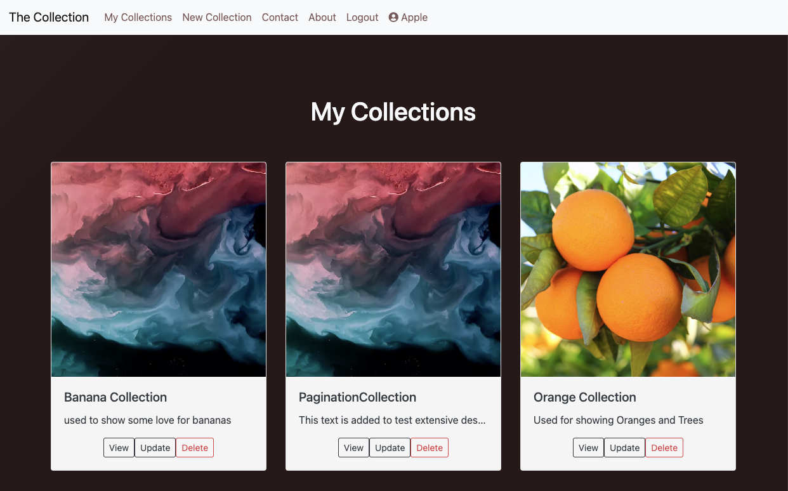
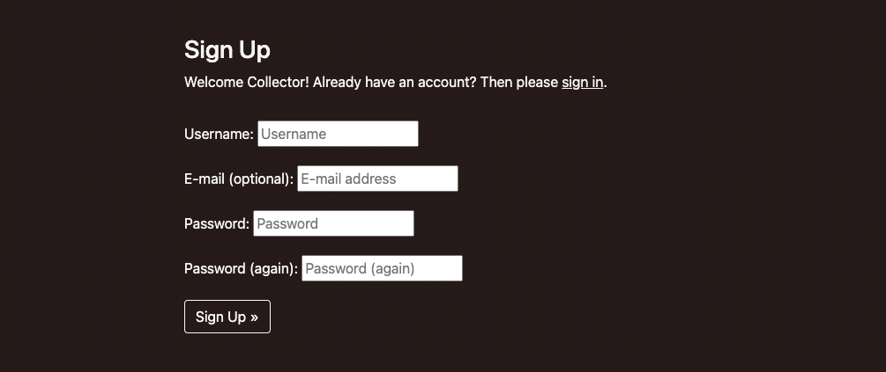

# Testing

Return back to the [README.md](README.md) file.

---

## Code Validation

### HTML

I have used the recommended [HTML W3C Validator](https://validator.w3.org) to validate all of my HTML files.

As my project uses Jinja syntax, such as ``, ``, and `{{ variable|filter }}`
it will not validate properly if I copy and paste into the HTML validator straight from my source files.

Usually in order to properly validate these types of files, it's recommended to
[validate by uri](https://validator.w3.org/#validate_by_uri) from the deployed Heroku pages.

Unfortunately, nearly all of the pages on this site require a user to be logged-in and authenticated,
and will not work using this method, due to the fact that the HTML Validator (W3C) doesn't have
access to login to the pages.

In order to properly validate my HTML pages with Jinja syntax for authenticated pages, I followed these steps:

- Navigate to the deployed pages which require authentication
- Right-click anywhere on the page, and select **View Page Source** (usually `CTRL+U` or `⌘+U` on Mac).
- This will display the entire "compiled" code, without any Jinja syntax.
- Copy everything, and use the [validate by input](https://validator.w3.org/#validate_by_input) method.
- Repeat this process for every page that requires a user to be logged-in/authenticated.

In the following table, all W3C testing is presented with snapshots.

W3C Validation Table with Snapshots

| Page | W3C URL | Screenshot | Notes |
| --- | --- | --- | --- |
| Home | [W3C](https://validator.w3.org/nu/?doc=https%3A%2F%2Fthe-collection-rpf13.herokuapp.com%2F) |  | No Errors / Warnings |
| SignUp | [W3C](https://validator.w3.org/nu/?doc=https%3A%2F%2Fthe-collection-rpf13.herokuapp.com%2Faccounts%2Fsignup%2F) |  | No Errors / Warnings |
| Login | [W3C](https://validator.w3.org/nu/?doc=https%3A%2F%2Fthe-collection-rpf13.herokuapp.com%2Faccounts%2Flogin%2F) |  | No Errors / Warnings |
| Collections (List) | n/a |  | No Errors / Warnings |
| Collection New | n/a |  | No Errors / Warnings |
| Collection Detail | n/a |  | No Errors / Warnings |
| Collection Detail Empty | n/a |  | No Errors / Warnings |
| Collection Update | n/a |  | No Errors / Warnings |
| Collection | Delete |  | No Errors / Warnings |
| Item Add | n/a |  | No Errors / Warnings |
| Item Update | n/a |  | No Errors / Warnings |
| Item Delete | n/a |  | No Errors / Warnings |
| Item Detail | n/a |  | No Errors / Warnings |
| Item Search Successful | n/a |  | No Errors / Warnings |
| Item Search False | n/a |  | No Errors / Warnings |
| Contact Form | n/a |  | No Errors / Warnings |
| Contact Form Confirmation | n/a |  | No Errors / Warnings |
| About | n/a |  | No Errors / Warnings |
| Logout | n/a |  | No Errors / Warnings |

---

### CSS

I have used the recommended [CSS Jigsaw Validator](https://jigsaw.w3.org/css-validator) to validate my CSS files.

| File | Jigsaw URL | Screenshot | Notes |
| --- | --- | --- | --- |
| style.css | [Jigsaw](http://jigsaw.w3.org/css-validator/validator?lang=en&profile=css3svg&uri=https%3A%2F%2Fthe-collection-rpf13.herokuapp.com%2F&usermedium=all&vextwarning=&warning=1) |  | Pass: No Errors |

---

### Python

I have used the recommended [CI Python Linter](https://pep8ci.herokuapp.com) to validate all of my Python files.

CI Python Linter Validation Table with Snapshots

| File | CI URL | Screenshot | Notes |
| --- | --- | --- | --- |
| main settings.py | [CI PEP8](https://pep8ci.herokuapp.com/https://raw.githubusercontent.com/rpf13/the-collection/main/main/settings.py) |  | Pass: No Errors |
| main urls.py | [CI PEP8](https://pep8ci.herokuapp.com/https://raw.githubusercontent.com/rpf13/the-collection/main/main/urls.py) |  | Pass: No Errors |
| main views.py | [CI PEP8](https://pep8ci.herokuapp.com/https://raw.githubusercontent.com/rpf13/the-collection/main/main/views.py) |  | Pass: No Errors |
| collection admin.py | [CI PEP8](https://pep8ci.herokuapp.com/https://raw.githubusercontent.com/rpf13/the-collection/main/collection/admin.py) |  | Pass: No Errors |
| collection apps.py | [CI PEP8](https://pep8ci.herokuapp.com/https://raw.githubusercontent.com/rpf13/the-collection/main/collection/apps.py) |  | Pass: No Errors |
| collection models.py | [CI PEP8](https://pep8ci.herokuapp.com/https://raw.githubusercontent.com/rpf13/the-collection/main/collection/models.py) |  | Pass: No Errors |
| collection tests.py | [CI PEP8](https://pep8ci.herokuapp.com/https://raw.githubusercontent.com/rpf13/the-collection/main/collection/tests.py) |  | Pass: No Errors |
| collection urls.py | [CI PEP8](https://pep8ci.herokuapp.com/https://raw.githubusercontent.com/rpf13/the-collection/main/collection/urls.py) |  | Pass: No Errors |
| collection views.py | [CI PEP8](https://pep8ci.herokuapp.com/https://raw.githubusercontent.com/rpf13/the-collection/main/collection/views.py) |  | Pass: No Errors |
| contact apps.py | [CI PEP8](https://pep8ci.herokuapp.com/https://raw.githubusercontent.com/rpf13/the-collection/main/contact/apps.py) |  | Pass: No Errors |
| contact forms.py | [CI PEP8](https://pep8ci.herokuapp.com/https://raw.githubusercontent.com/rpf13/the-collection/main/contact/forms.py) |  | Pass: No Errors |
| contact urls.py | [CI PEP8](https://pep8ci.herokuapp.com/https://raw.githubusercontent.com/rpf13/the-collection/main/contact/urls.py) |  | Pass: No Errors |
| contact views.py | [CI PEP8](https://pep8ci.herokuapp.com/https://raw.githubusercontent.com/rpf13/the-collection/main/contact/views.py) |  | Pass: No Errors |

---

## Browser Compatibility

⚠️⚠️⚠️⚠️⚠️ START OF NOTES (to be deleted) ⚠️⚠️⚠️⚠️⚠️

Use this space to discuss testing the live/deployed site on various browsers.

Consider testing at least 3 different browsers, if available on your system.

Recommended browsers to consider:
- [Chrome](https://www.google.com/chrome)
- [Firefox (Developer Edition)](https://www.mozilla.org/firefox/developer)
- [Edge](https://www.microsoft.com/edge)
- [Safari](https://support.apple.com/downloads/safari)
- [Brave](https://brave.com/download)
- [Opera](https://www.opera.com/download)

**IMPORTANT**: You must provide screenshots of the tested browsers, to "prove" that you've actually tested them.

Please note, there are services out there that can test multiple browser compatibilities at the same time.
Some of these are paid services, but some are free.
If you use these, you must provide a link to the source used for attribution, and multiple screenshots of the results.

Sample browser testing documentation:

🛑🛑🛑🛑🛑 END OF NOTES (to be deleted) 🛑🛑🛑🛑🛑

I've tested my deployed project on multiple browsers to check for compatibility issues.

| Browser | Screenshot | Notes |
| --- | --- | --- |
| Chrome |  | Works as expected |
| Firefox |  | Works as expected |
| Edge |  | Works as expected |
| Safari |  | Minor CSS differences |
| Brave |  | Works as expected |
| Opera |  | Minor differences |
| Internet Explorer |  | Does not work as expected |
| x | x | repeat for any other tested browsers |
| x | x | repeat for any other tested browsers |
| x | x | repeat for any other tested browsers |
| x | x | repeat for any other tested browsers |
| x | x | repeat for any other tested browsers |
| x | x | repeat for any other tested browsers |

## Responsiveness

⚠️⚠️⚠️⚠️⚠️ START OF NOTES (to be deleted) ⚠️⚠️⚠️⚠️⚠️

Use this space to discuss testing the live/deployed site on various device sizes.

The minimum requirement is for the following 3 tests:
- Mobile
- Tablet
- Desktop

**IMPORTANT**: You must provide screenshots of the tested responsiveness, to "prove" that you've actually tested them.

Using the "amiresponsive" mockup image (or similar) does not suffice the requirements.
Consider using some of the built-in device sizes in the Developer Tools.

If you have tested the project on your actual mobile phone or tablet, consider also including screenshots of these as well.
It showcases a higher level of manual tests, and can be seen as a positive inclusion!

Sample responsiveness testing documentation:

🛑🛑🛑🛑🛑 END OF NOTES (to be deleted) 🛑🛑🛑🛑🛑

I've tested my deployed project on multiple devices to check for responsiveness issues.

| Device | Screenshot | Notes |
| --- | --- | --- |
| Mobile (DevTools) |  | Works as expected |
| Tablet (DevTools) |  | Works as expected |
| Desktop |  | Works as expected |
| XL Monitor |  | Scaling starts to have minor issues |
| 4K Monitor |  | Noticeable scaling issues |
| Google Pixel 7 Pro |  | Works as expected |
| iPhone 14 |  | Works as expected |
| x | x | repeat for any other tested sizes |

## Lighthouse Audit

⚠️⚠️⚠️⚠️⚠️ START OF NOTES (to be deleted) ⚠️⚠️⚠️⚠️⚠️

Use this space to discuss testing the live/deployed site's Lighthouse Audit reports.
Avoid testing the local version (especially if developing in Gitpod), as this can have knock-on effects of performance.

If you don't have Lighthouse in your Developer Tools,
it can be added as an [extension](https://chrome.google.com/webstore/detail/lighthouse/blipmdconlkpinefehnmjammfjpmpbjk).

Don't just test the home page (unless it's a single-page application).
Make sure to test the Lighthouse Audit results for all of your pages.

**IMPORTANT**: You must provide screenshots of the results, to "prove" that you've actually tested them.

Sample Lighthouse testing documentation:

🛑🛑🛑🛑🛑 END OF NOTES (to be deleted) 🛑🛑🛑🛑🛑

I've tested my deployed project using the Lighthouse Audit tool to check for any major issues.

| Page | Size | Screenshot | Notes |
| --- | --- | --- | --- |
| Home | Mobile |  | Some minor warnings |
| Home | Desktop |  | Few warnings |
| About | Mobile |  | Some minor warnings |
| About | Desktop |  | Few warnings |
| Gallery | Mobile |  | Slow response time due to large images |
| Gallery | Desktop |  | Slow response time due to large images |
| x | x | x | repeat for any other tested pages/sizes |

## Defensive Programming

⚠️⚠️⚠️⚠️⚠️ START OF NOTES (to be deleted) ⚠️⚠️⚠️⚠️⚠️

Defensive programming (defensive design) is extremely important!

When building projects that accept user inputs or forms, you should always test the level of security for each.
Examples of this could include (not limited to):

Forms:
- Users cannot submit an empty form
- Users must enter valid email addresses

PP3 (Python-only):
- Users must enter a valid letter/word/string when prompted
- Users must choose from a specific list only

Flask/Django:
- Users cannot brute-force a URL to navigate to a restricted page
- Users cannot perform CRUD functionality while logged-out
- User-A should not be able to manipulate data belonging to User-B, or vice versa
- Non-Authenticated users should not be able to access pages that require authentication
- Standard users should not be able to access pages intended for superusers

You'll want to test all functionality on your application, whether it's a standard form,
or uses CRUD functionality for data manipulation on a database.
Make sure to include the `required` attribute on any form-fields that should be mandatory.
Try to access various pages on your site as different user types (User-A, User-B, guest user, admin, superuser).

You should include any manual tests performed, and the expected results/outcome.

🛑🛑🛑🛑🛑 END OF NOTES (to be deleted) 🛑🛑🛑🛑🛑

Defensive programming was manually tested with the below user acceptance testing:

| Page | User Action | Expected Result | Pass/Fail | Comments |
| --- | --- | --- | --- | --- |
| Home Page | | | | |
| | Click on Logo | Redirection to Home page | Pass | |
| | Click on Home link in navbar | Redirection to Home page | Pass | |
| Gallery Page | | | | |
| | Click on Gallery link in navbar | Redirection to Gallery page | Pass | |
| | Load gallery images | All images load as expected | Pass | |
| Contact Page | | | | |
| | Click on Contact link in navbar | Redirection to Contact page | Pass | |
| | Enter first/last name | Field will accept freeform text | Pass | |
| | Enter valid email address | Field will only accept email address format | Pass | |
| | Enter message in textarea | Field will accept freeform text | Pass | |
| | Click the Submit button | Redirects user to form-dump | Pass | User must click 'Back' button to return |
| Sign Up | | | | |
| | Click on Sign Up button | Redirection to Sign Up page | Pass | |
| | Enter valid email address | Field will only accept email address format | Pass | |
| | Enter valid password (twice) | Field will only accept password format | Pass | |
| | Click on Sign Up button | Asks user to confirm email page | Pass | Email sent to user |
| | Confirm email | Redirects user to blank Sign In page | Pass | |
| Log In | | | | |
| | Click on the Login link | Redirection to Login page | Pass | |
| | Enter valid email address | Field will only accept email address format | Pass | |
| | Enter valid password | Field will only accept password format | Pass | |
| | Click Login button | Redirects user to home page | Pass | |
| Log Out | | | | |
| | Click Logout button | Redirects user to logout page | Pass | Confirms logout first |
| | Click Confirm Logout button | Redirects user to home page | Pass | |
| Profile | | | | |
| | Click on Profile button | User will be redirected to the Profile page | Pass | |
| | Click on the Edit button | User will be redirected to the edit profile page | Pass | |
| | Click on the My Orders link | User will be redirected to the My Orders page | Pass | |
| | Brute forcing the URL to get to another user's profile | User should be given an error | Pass | Redirects user back to own profile |

⚠️⚠️⚠️⚠️⚠️ START OF NOTES (to be deleted) ⚠️⚠️⚠️⚠️⚠️

Repeat for all other tests, as applicable to your own site.
The aforementioned tests are just an example of a few different project scenarios.

🛑🛑🛑🛑🛑 END OF NOTES (to be deleted) 🛑🛑🛑🛑🛑

---

## User Story Testing

I have tested the functional user stories and listed in the following table, together with a screenshot. Since I did also add user stories for admin tasks like mentor sessions, documentation, app submission, I did not include them in the table - since snapshots are difficult for those. However, they are also clearly documented in the README section.

User story testing Table with Snapshots

| User Story | Screenshot | Comment |
| --- | --- | --- |
| As a Developer I can create a Collection model, view & template so that I can save actual data for a new collection and display it [#32](https://github.com/rpf13/the-collection/issues/32) `(MustHave)` |   | |
| As a Developer I can create an item(s) model, view & template so that a user can add items to his collections [#33](https://github.com/rpf13/the-collection/issues/33) `(MustHave)` |   | |
| As a Developer I can style the collection & items sites in the way that it reflects the overall design. Furthermore, I can update the navigation between the two as well as the rest of the app so that the user has a overall design experience throughout the whole app and can easily navigate between the sections. [#34](https://github.com/rpf13/the-collection/issues/34) `(MustHave)` |   | |
| As a Developer I can add a generic image to a catalog and items by default so that the user has an nice look and feel even though he does not want to upload an image to a collection or item. [#35](https://github.com/rpf13/the-collection/issues/35) `(CouldHave)` |   | The blueish image in the collection is the default image. The red/blue clouds is the items default |
| As a Developer I can create an update & delete model so that a registered user can update or delete one of his collections and all the related items [#51](https://github.com/rpf13/the-collection/issues/51) `(MustHave)` |  | |
| As a Developer I can create an update & delete model so that a registered user can update or delete one of his items [#52](https://github.com/rpf13/the-collection/issues/52) `(MustHave)` |  | |
| As a user I can register an account so that I can create, update, delete a new collection and the individual items [#23](https://github.com/rpf13/the-collection/issues/23) `(MustHave)` |  | |
| As a user I can login & logout of my account so that my account is secured and no one else has access to my collections [#24](https://github.com/rpf13/the-collection/issues/24) `(MustHave)` |   | |
| As a user I can see the status of authentication int he navbar so that I can easily see whether I am logged in or not [#25](https://github.com/rpf13/the-collection/issues/25) `(ShouldHave)` |  | The username is displayed next to the user icon, user is "Apple" in this example |
| As a developer I can create an admin / superuser so that I can login to the django admin panel and will be able to see newly created user profiles [#50](https://github.com/rpf13/the-collection/issues/50) `(MustHave)` |   | |
| As a Developer I can create the base html template so that I can get a default main page and have the base concept / styling for all the subsequent sites [#28](https://github.com/rpf13/the-collection/issues/28) `(MustHave)` |  | |
| As a Developer I can add a beautiful glow effect to the "The Collection" site main title so that the user will have a stunning effect, when visiting the main site [#29](https://github.com/rpf13/the-collection/issues/29) `ShouldHave` |  | Glow effect got "replaced" with the transparent header / moving background |
| As a Developer I can add the main nav bar to the site so that a user can navigate through all content on the site [#30](https://github.com/rpf13/the-collection/issues/30) `MustHave` |  | |
| As a Developer I can update the raw styling of the app so that the site looks nice, is responsive and reflects state of the art guidelines [#53](https://github.com/rpf13/the-collection/issues/53) `MustHave` |  | image is just one example, whole site has one styling cocnept |
| As a Developer I can create a search functionality inside a collection so that a user can search for items in a easy and very fast way. [#36](https://github.com/rpf13/the-collection/issues/36) `ShouldHave` |   | Search successful and unsuccessful are covered |
| As a Developer I can adjust the collection / items template so that the search field has a central place and has an integrated look and feel to the user so that it is obvious for a user to use the search. [#37](https://github.com/rpf13/the-collection/issues/37) `ShouldHave` |  | |
| As a Developer I can create a feedback site so that a user can get in contact with the developer / site owner [#38](https://github.com/rpf13/the-collection/issues/38) `ShouldHave` |  | |
| As a Developer I can connect / implement the feedback form with a email provider like emailJS so that a user can actually send a real feedback, which the site owner will receive [#39](https://github.com/rpf13/the-collection/issues/39) `ShouldHave` |   | Mailtrap.io has been used as the mailprovider |
| As a Developer I can create an "About this site" page so that a user can understand and read what it is all about including legal aspects of content upload, terms and condition. [#40](https://github.com/rpf13/the-collection/issues/40) `CouldHave` |  | |
| As a Developer I can create a 403 Unauthorized error page so that so that an unauthorized user gets redirect and receives a useful error page, my views are secured [#41](https://github.com/rpf13/the-collection/issues/41) `MustHave` |  | 403 error could not be forced since in such case user gets redirected to login/signup. Image is representative, 403 looks identical. |
| As a Developer I can create a 404 Not found error page so that so that a user gets redirect and receives a useful error page [#42](https://github.com/rpf13/the-collection/issues/42) `MustHave` |  | |
| As a Developer I can create a 500 server error page so that so that a user gets redirect and receives a useful error page [#43](https://github.com/rpf13/the-collection/issues/43) `MustHave` |  | Image is raw styling snapshot, since I had to tweak the model to force such error, which I did during development |

---

## Automated Testing

I have conducted a series of automated tests on my application.

I fully acknowledge and understand that, in a real-world scenario, an extensive set of additional tests would be more comprehensive.

### Python (Unit Testing)

⚠️⚠️⚠️⚠️⚠️ START OF NOTES (to be deleted) ⚠️⚠️⚠️⚠️⚠️

Adjust the code below (file names, etc.) to match your own project files/folders.

🛑🛑🛑🛑🛑 END OF NOTES (to be deleted) 🛑🛑🛑🛑🛑

I have used Django's built-in unit testing framework to test the application functionality.

In order to run the tests, I ran the following command in the terminal each time:

`python3 manage.py test name-of-app `

To create the coverage report, I would then run the following commands:

`coverage run --source=name-of-app manage.py test`

`coverage report`

To see the HTML version of the reports, and find out whether some pieces of code were missing, I ran the following commands:

`coverage html`

`python3 -m http.server`

Below are the results from the various apps on my application that I've tested:

| App | File | Coverage | Screenshot |
| --- | --- | --- | --- |
| Bag | test_forms.py | 99% |  |
| Bag | test_models.py | 89% |  |
| Bag | test_urls.py | 100% |  |
| Bag | test_views.py | 71% |  |
| Checkout | test_forms.py | 99% |  |
| Checkout | test_models.py | 89% |  |
| Checkout | test_urls.py | 100% |  |
| Checkout | test_views.py | 71% |  |
| Home | test_forms.py | 99% |  |
| Home | test_models.py | 89% |  |
| Home | test_urls.py | 100% |  |
| Home | test_views.py | 71% |  |
| Products | test_forms.py | 99% |  |
| Products | test_models.py | 89% |  |
| Products | test_urls.py | 100% |  |
| Products | test_views.py | 71% |  |
| Profiles | test_forms.py | 99% |  |
| Profiles | test_models.py | 89% |  |
| Profiles | test_urls.py | 100% |  |
| Profiles | test_views.py | 71% |  |
| x | x | x | repeat for all remaining tested apps/files |

#### Unit Test Issues

⚠️⚠️⚠️⚠️⚠️ START OF NOTES (to be deleted) ⚠️⚠️⚠️⚠️⚠️

Use this section to list any known issues you ran into while writing your unit tests.
Remember to include screenshots (where possible), and a solution to the issue (if known).

This can be used for both "fixed" and "unresolved" issues.

🛑🛑🛑🛑🛑 END OF NOTES (to be deleted) 🛑🛑🛑🛑🛑

## Bugs

⚠️⚠️⚠️⚠️⚠️ START OF NOTES (to be deleted) ⚠️⚠️⚠️⚠️⚠️

It's very important to document any bugs you've discovered while developing the project.
Make sure to include any necessary steps you've implemented to fix the bug(s) as well.

For JavaScript and Python applications, it's best to screenshot the errors to include them as well.

**PRO TIP**: screenshots of bugs are extremely helpful, and go a long way!

🛑🛑🛑🛑🛑 END OF NOTES (to be deleted) 🛑🛑🛑🛑🛑

- JS Uncaught ReferenceError: `foobar` is undefined/not defined

    

    - To fix this, I _____________________.

- JS `'let'` or `'const'` or `'template literal syntax'` or `'arrow function syntax (=>)'` is available in ES6 (use `'esversion: 11'`) or Mozilla JS extensions (use moz).

    

    - To fix this, I _____________________.

- Python `'ModuleNotFoundError'` when trying to import module from imported package

    

    - To fix this, I _____________________.

- Django `TemplateDoesNotExist` at /appname/path appname/template_name.html

    

    - To fix this, I _____________________.

- Python `E501 line too long` (93 > 79 characters)

    

    - To fix this, I _____________________.

### GitHub **Issues**

⚠️⚠️⚠️⚠️⚠️ START OF NOTES (to be deleted) ⚠️⚠️⚠️⚠️⚠️

An improved way to manage bugs is to use the built-in **Issues** tracker on your GitHub repository.
To access your Issues, click on the "Issues" tab at the top of your repository.
Alternatively, use this link: https://github.com/rpf13/the-collection/issues

If using the Issues tracker for your bug management, you can simplify the documentation process.
Issues allow you to directly paste screenshots into the issue without having to first save the screenshot locally,
then uploading into your project.

You can add labels to your issues (`bug`), assign yourself as the owner, and add comments/updates as you progress with fixing the issue(s).

Once you've sorted the issue, you should then "Close" it.

When showcasing your bug tracking for assessment, you can use the following format:

🛑🛑🛑🛑🛑 END OF NOTES (to be deleted) 🛑🛑🛑🛑🛑

**Fixed Bugs**

All previously closed/fixed bugs can be tracked [here](https://github.com/rpf13/the-collection/issues?q=is%3Aissue+is%3Aclosed).

| Bug | Status |
| --- | --- |
| [JS Uncaught ReferenceError: `foobar` is undefined/not defined](https://github.com/rpf13/the-collection/issues/1) | Closed |
| [Python `'ModuleNotFoundError'` when trying to import module from imported package](https://github.com/rpf13/the-collection/issues/2) | Closed |
| [Django `TemplateDoesNotExist` at /appname/path appname/template_name.html](https://github.com/rpf13/the-collection/issues/3) | Closed |

**Open Issues**

Any remaining open issues can be tracked [here](https://github.com/rpf13/the-collection/issues).

| Bug | Status |
| --- | --- |
| [JS `'let'` or `'const'` or `'template literal syntax'` or `'arrow function syntax (=>)'` is available in ES6 (use `'esversion: 11'`) or Mozilla JS extensions (use moz).](https://github.com/rpf13/the-collection/issues/4) | Open |
| [Python `E501 line too long` (93 > 79 characters)](https://github.com/rpf13/the-collection/issues/5) | Open |

## Unfixed Bugs

⚠️⚠️⚠️⚠️⚠️ START OF NOTES (to be deleted) ⚠️⚠️⚠️⚠️⚠️

You will need to mention unfixed bugs and why they were not fixed.
This section should include shortcomings of the frameworks or technologies used.
Although time can be a big variable to consider, paucity of time and difficulty understanding
implementation is not a valid reason to leave bugs unfixed.

If you've identified any unfixed bugs, no matter how small, be sure to list them here.
It's better to be honest and list them, because if it's not documented and an assessor finds the issue,
they need to know whether or not you're aware of them as well, and why you've not corrected/fixed them.

Some examples:

🛑🛑🛑🛑🛑 END OF NOTES (to be deleted) 🛑🛑🛑🛑🛑

- On devices smaller than 375px, the page starts to have `overflow-x` scrolling.

    

    - Attempted fix: I tried to add additional media queries to handle this, but things started becoming too small to read.

- For PP3, when using a helper `clear()` function, any text above the height of the terminal does not clear, and remains when you scroll up.

    

    - Attempted fix: I tried to adjust the terminal size, but it only resizes the actual terminal, not the allowable area for text.

- When validating HTML with a semantic `section` element, the validator warns about lacking a header `h2-h6`. This is acceptable.

    

    - Attempted fix: this is a known warning and acceptable, and my section doesn't require a header since it's dynamically added via JS.

⚠️⚠️⚠️⚠️⚠️ START OF NOTES (to be deleted) ⚠️⚠️⚠️⚠️⚠️

If you legitimately cannot find any unfixed bugs or warnings, then use the following sentence:

🛑🛑🛑🛑🛑 END OF NOTES (to be deleted) 🛑🛑🛑🛑🛑

There are no remaining bugs that I am aware of.
